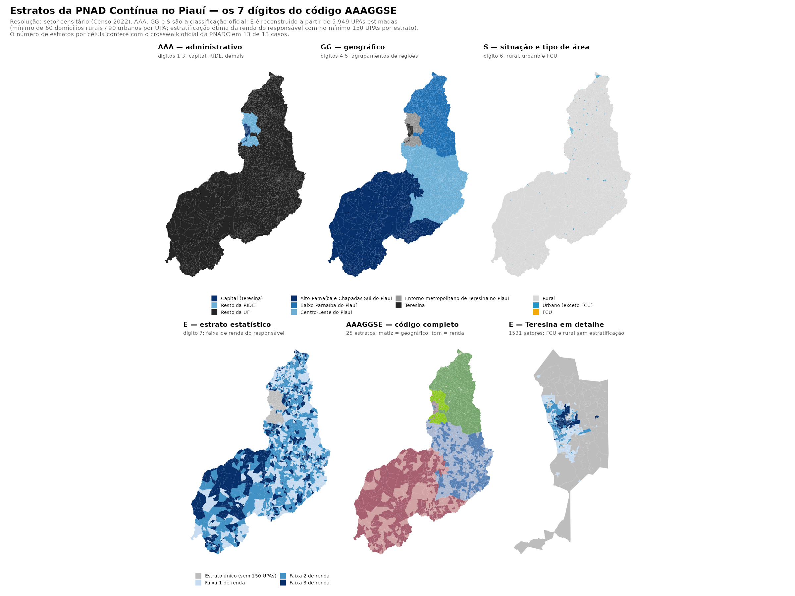

# Estratos da PNAD Contínua no Piauí — reconstrução do código AAAGGSE

Reconstrução dos sete dígitos do `Estrato` da PNAD Contínua no Piauí, na
resolução do setor censitário, incluindo o **estrato estatístico** (o 7º
dígito), que não tem fronteira publicada pelo IBGE.



## O problema

O `Estrato` da PNADC segue a estrutura `AAAGGSE`:

| Posição | Componente | Fonte |
|---|---|---|
| `AAA` (1-3) | Estratificação administrativa — capital, RM, RIDE, demais | município |
| `GG` (4-5) | Estratificação geográfica — agrupamentos de regiões | polígono oficial da PNADC |
| `S` (6) | Situação e tipo de área — rural, urbano tradicional, FCU | `CD_SIT` e `CD_TIPO` da malha 2022 |
| `E` (7) | Estrato estatístico — renda do responsável pelo domicílio | **reconstruído aqui** |

`AAA`, `GG` e `S` são recuperáveis diretamente de fontes públicas. O `E` não:
a especificação do IBGE diz apenas que, "para cada estrato geográfico, serão
definidos de 2 a 5 estratos estatísticos, garantido que cada um tenha pelo
menos 150 UPAs", com o objetivo de "minimizar a variância do estimador da
renda do responsável pelo domicílio".

Como o critério é enunciado em **UPAs**, e não em setores, é preciso
reconstruir as UPAs antes de chegar no `E`.

## Resultado

**A reconstrução acerta o número de estratos estatísticos em 11 de 11
células geográficas do Piauí**, validada contra o `crosswalk_estratos.csv`
extraído dos microdados da própria PNADC.

Dos 26 estratos oficiais do estado, 25 têm contrapartida reconstruída 1:1
(veja `output/tabelas/equivalencia_estratos.csv`).

## Como o `E` é estimado

### 1. Construção das UPAs (`R/06_upas_piaui.R`)

Critérios do Censo 2022: setores **contíguos**, respeitando situação e tipo de
área, com mínimo de **60 domicílios particulares permanentes ocupados** para
UPAs rurais e **90** para urbanas (dentro e fora de FCU).

Implementação: grafo de contiguidade (`sf::st_touches`) dentro de cada célula
`município × S`; agregação gulosa que a cada passo funde a unidade mais
deficitária com o vizinho de menor carga (fundir com o *menor* espalha a massa
em vez de criar UPAs gigantes). Setor que já atinge o mínimo sozinho vira UPA
individual, como a especificação permite.

A contagem de domicílios vem de `V06001` ("pessoas responsáveis em domicílios
particulares permanentes ocupados") — como todo domicílio tem exatamente uma
pessoa responsável, `V06001` **é** a contagem de DPPO do setor.

**Resultado: 5.949 UPAs a partir de 7.331 setores**, nenhuma abaixo do mínimo.

### 2. Estratificação ótima (`R/07_estrato_estatistico.R`)

Problema clássico de estratificação univariada (Dalenius & Hodges, 1959;
Lavallée & Hidiroglou, 1988; Kozak, 2004): cortar a população em faixas que
minimizem a variância do estimador da média sob alocação de Neyman, ou seja
minimizar `Σ_h W_h · S_h`.

O IBGE usa heurísticas porque resolve o Brasil inteiro. **Na escala do Piauí o
problema é pequeno o bastante para ser resolvido de forma exata.** Os estratos
ótimos são sempre intervalos contíguos da variável ordenada, então basta
escolher os `k-1` pontos de corte — um problema de programação dinâmica em
`O(k·n²)`, com `n ≤ 929`. Roda em menos de um segundo e devolve o ótimo global.

Como conferência, o script roda também as duas alternativas da especificação:

| Método | Resultado |
|---|---|
| Programação dinâmica (exato) | ótimo global |
| Busca aleatória tipo Kozak (estocástico) | **empata com a DP nas 7 células** |
| cum-√f (Dalenius-Hodges) | pior em todas as 7 |

DP e Kozak convergirem ao mesmo valor confirma que a solução está no ótimo.

### 3. Quantos estratos? A regra veio dos dados

A especificação diz "de 2 a 5" mas não diz como escolher. Testando as regras
candidatas contra as 13 células observadas:

| Regra | Acertos |
|---|---|
| `k = floor(n_UPAs / 150)`, capado em 5 | 7 de 13 |
| `k = 3` se `n_UPAs ≥ 450`, senão 1 | **13 de 13** |

**No Piauí o IBGE não maximiza o número de estratos: ele mira em 3 e só abre
mão quando não há UPAs para sustentar 3 × 150 = 450.** O caso que separa as
duas regras é Teresina-FCU (300 UPAs): comportaria 2 estratos, mas ficou com 1
— como a regra dos 450 prevê.

A regra está parametrizada em `K_ALVO`, não fixa no código.

### Redução de variância obtida

| Célula | UPAs | k | Redução da variância |
|---|---|---|---|
| Teresina urbano | 929 | 3 | 89,5% |
| Centro-Leste urbano | 734 | 3 | 81,3% |
| Centro-Leste rural | 864 | 3 | 79,7% |
| Baixo Parnaíba urbano | 818 | 3 | 82,6% |
| Baixo Parnaíba rural | 837 | 3 | 75,9% |
| Alto Parnaíba urbano | 505 | 3 | 80,8% |
| Alto Parnaíba rural | 489 | 3 | 75,4% |

Em todas as células a restrição de 150 UPAs é **ativa no estrato superior**
(que fica com exatamente 150): a renda é assimétrica à direita, o ótimo
irrestrito quereria um estrato de renda alta menor, e o piso é o que impede.

## Ressalvas

1. **O `E` é uma reconstrução, não o `E` oficial.** O número de estratos e as
   faixas de renda são reproduzidos; a atribuição UPA a UPA não é verificável
   porque o IBGE não publica as UPAs.

2. **O IBGE numera o `E` de forma inconsistente** — em umas células usa
   `{1,2,3}`, em outras `{0,1,2}` para o mesmo número de estratos. Eu numero
   sempre `1..k` em ordem crescente de renda. Por isso *comparar os códigos
   como texto engana*: o `2251021` reconstruído é a faixa de renda mais baixa,
   enquanto o `2251021` oficial é a do meio. Só o de-para por posição
   (`equivalencia_estratos.csv`) é confiável.

3. **O estrato `2254020` não é reconstruído.** A camada do GeoServer não
   define o código `2254` — ele simplesmente não existe entre os polígonos
   publicados, e por isso seu território está aglutinado dentro do `2253`.
   Não é limitação do método nem perda no processamento: a fronteira não é
   pública. Separá-lo exigiria uma fonte externa que liste a composição
   municipal dos estratos geográficos da PNADC; os microdados não servem,
   porque a PNADC não divulga o município do domicílio.

   Consequência prática: as 489 UPAs rurais do "Alto Parnaíba e Chapadas Sul"
   são estratificadas como uma célula só, enquanto o IBGE as reparte entre
   `2253` (3 estratos) e `2254` (1 estrato).

4. **Peso da renda.** `V06004` é o rendimento médio dos responsáveis *com*
   rendimento, mas `V06001` conta *todos* os responsáveis. O peso correto seria
   o número de responsáveis com rendimento, que a tabela não publica.

5. **A regra dos 450 é um ajuste sobre 13 células de uma única UF.** Explica o
   Piauí inteiro, mas não se pode afirmar que 3 seja política nacional — pode
   ser que o Piauí nunca tenha tido UPAs para 4 ou 5.

## Ordem de execução

```
pipeline_trimestral.R        -> output/crosswalk_estratos.csv
04_mapas_estratos_piaui.R    -> output/estratos_piaui.gpkg
06_upas_piaui.R              -> output/upas_piaui.csv            (5.949 UPAs)
07_estrato_estatistico.R     -> output/upas_com_estrato_estatistico.csv
08_mapa_aaagsse.R            -> output/figuras/mapa_aaagsse_piaui.png
```

### Dados necessários (não versionados)

| Arquivo | Fonte |
|---|---|
| `data/raw/setores/PI_setores_CD2022.shp` | malhas de setores censitários, Censo 2022 |
| `data/raw/renda/Agregados_por_setores_renda_responsavel_BR.xlsx` | Agregados por Setores — renda do responsável |

O script filtra o Piauí da planilha nacional uma vez e guarda em
`data/raw/renda/renda_responsavel_PI.csv`.

## Saídas

| Arquivo | Conteúdo |
|---|---|
| `output/upas_piaui.csv` | uma linha por UPA: DPPO, renda, célula geográfica |
| `output/upas_com_estrato_estatistico.csv` | UPA → `E` e código de 7 dígitos |
| `output/setores_com_estrato_completo.gpkg` | setor → `AAAGGSE` |
| `output/tabelas/validacao_contra_crosswalk.csv` | k reconstruído × k oficial |
| `output/tabelas/equivalencia_estratos.csv` | de-para reconstruído → oficial |
| `output/tabelas/comparacao_metodos_estratificacao.csv` | DP × cum-√f × Kozak |
| `output/tabelas/diagnostico_upas.csv` | diagnóstico da construção das UPAs |
| `output/figuras/mapa_aaagsse_piaui.png` | a figura, 6 painéis |
