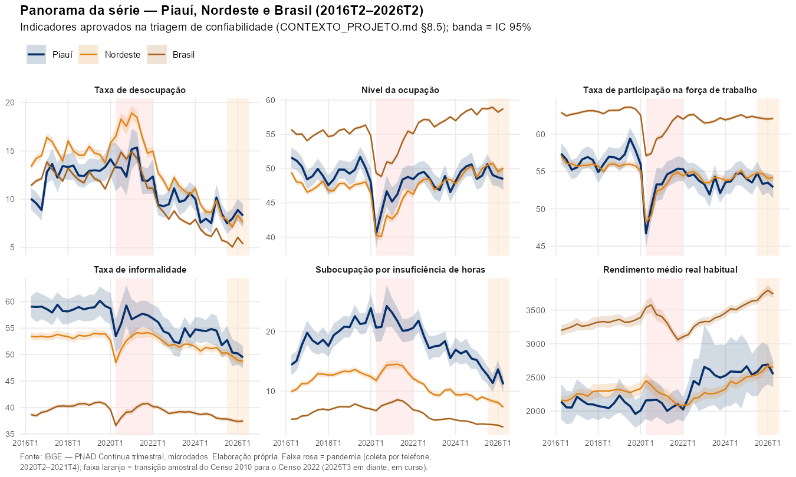
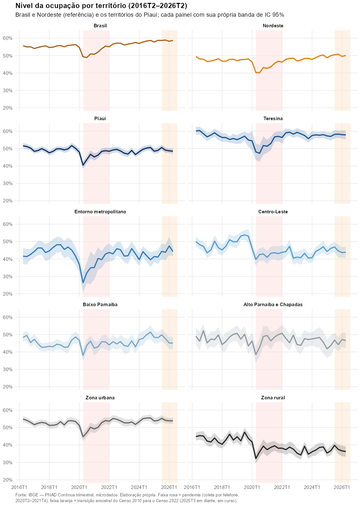
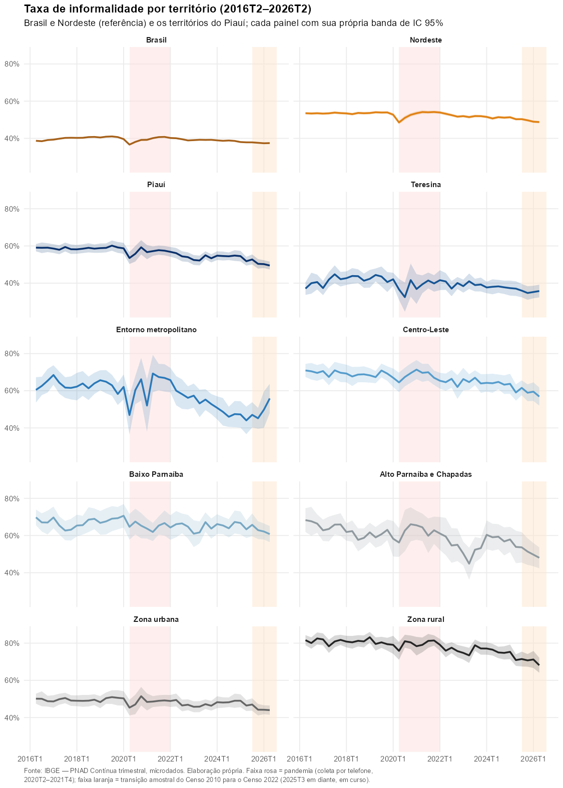
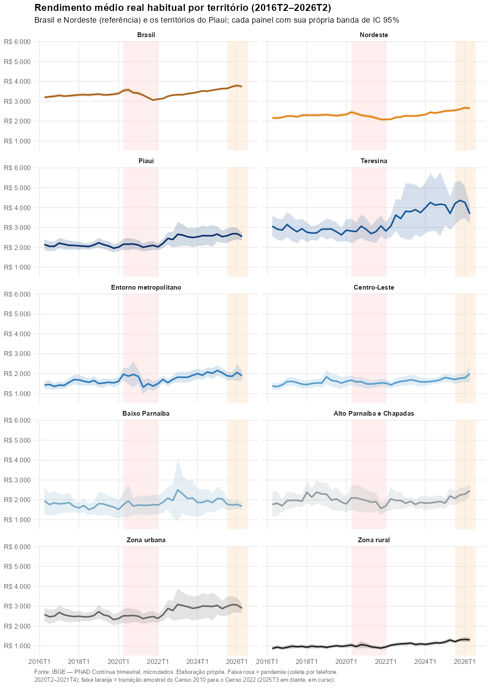

<!-- GERADO AUTOMATICAMENTE por R/09_preencher_relatorio.R a partir de ./output/relatorio_trimestral.md. Trimestre: 2026T2. Não editar à mão — a próxima rodada sobrescreve sem aviso. -->

**VERSÃO AUTOMÁTICA DO RELATÓRIO — REVER OS TEXTOS E REDIGIR AS ANÁLISES**

## 1 Destaques do trimestre

No 2º trimestre de 2026, a taxa de desocupação do Piauí foi de
8,3%, ante 7,6% no
Nordeste e 5,4% no Brasil. A taxa de participação
na força de trabalho ficou em 52,9%
(62,1% no Brasil) e a taxa composta de
subutilização, em 26,6%. O rendimento
médio real habitual do trabalho no estado, de
R\$ 2.547, equivale a
68,1% do nacional.

**Tabela 1** — Indicadores de destaque: Brasil, Nordeste e Piauí — 2º trimestre de 2026

| Indicador | Brasil | Nordeste | Piauí |
|---|---:|---:|---:|
| Taxa de participação na força de trabalho (%) | 62,1 | 54,2 | **52,9** |
| Nível da ocupação (%) | 58,8 | 50,1 | **48,5** |
| Taxa de desocupação (%) | 5,4 | 7,6 | **8,3** |
| Taxa composta de subutilização (%) | 12,9 | 21,4 | **26,6** |
| Taxa de informalidade (%) | 37,4 | 48,7 | **49,5** |
| Rendimento médio real habitual (R\$) | R\$ 3.738 | R\$ 2.645 | **R\$ 2.547** |
| Índice de Gini do rendimento do trabalho | 0,484 | 0,499 | **0,507** |
| Jovens de 14 a 29 anos que não estudam nem trabalham (%) | 17,9 | 24,5 | **24,3** |

Fonte: IBGE — PNAD Contínua trimestral, microdados. Elaboração própria.
Nota: † = precisão regular na série; – = não sustenta leitura. Ver seção 3.

> **A REDIGIR** — dois ou três parágrafos com a leitura dos destaques do trimestre — Piauí frente a Brasil e Nordeste.

## 2 Panorama da série

A Tabela 1 retrata o trimestre corrente; esta seção mostra a trajetória desde
2016T2 dos seis indicadores aprovados na triagem de confiabilidade (Anexo B) —
taxa de desocupação, nível da ocupação, taxa de participação, taxa de
informalidade, subocupação por insuficiência de horas e rendimento médio real
habitual, para o Piauí, com Brasil e Nordeste como referência. A banda sombreada em cada gráfico é o intervalo
de confiança de 95%; a faixa rosa marca a coleta por telefone durante a
pandemia (2020T2–2021T4) e a faixa laranja, a transição em curso do desenho
amostral do Censo 2010 para o Censo 2022 (2025T3 em diante) — dois períodos em
que a leitura da série pede mais cautela.

**Figura 1** — Panorama da série: indicadores-farol do Piauí, do Nordeste e do Brasil, 2016T2–2º trimestre de 2026

Fonte: IBGE — PNAD Contínua trimestral, microdados. Elaboração própria.

> **A REDIGIR** — leitura da Figura 1 — um ou dois parágrafos sobre a trajetória geral (recuperação pós-pandemia, patamar atual frente ao início da série).

## 3 Como ler as tabelas

Todas as estimativas vêm de uma amostra, e por isso cada número tem uma
margem de erro. Três marcas orientam a leitura:

- **Valor sem marca**: o indicador, naquele território, teve coeficiente de
  variação abaixo de 15% em pelo menos 80% dos trimestres desde 2022. É um
  número confiável para acompanhamento trimestral.
- **Valor com †**: precisão regular (coeficiente de variação entre 15% e 30%
  na maior parte da série). Serve como indicação, não como base para decisão.
- **–**: a amostra não sustenta a estimativa naquele território.

Brasil e Nordeste aparecem como referência. Para eles, a marca segue o
coeficiente de variação do próprio trimestre, com os mesmos cortes.

Os **asteriscos** dizem se as diferenças são estatisticamente significativas,
isto é, se não se explicam por acaso amostral: \*\*\* p < 0,001; \*\* p < 0,01;
\* p < 0,05; ns = não significativo. Nas matrizes territoriais, a coluna
"Teste estratos" diz se os cinco estratos diferem entre si e "Teste zona", se
urbano e rural diferem. Os testes não apontam *qual*
território difere — para isso, compare os valores. Detalhes na nota
metodológica (Anexo A).

## 4 Ocupação e desocupação

**Figura 2** — Nível da ocupação por território, 2016T2–2º trimestre de 2026

Fonte: IBGE — PNAD Contínua trimestral, microdados. Elaboração própria.

**Tabela 2** — Ocupação e desocupação, por território — 2º trimestre de 2026

| Indicador | Brasil | Nordeste | Piauí | Teresina | Entorno metropolitano | Centro-Leste | Baixo Parnaíba | Alto Parnaíba e Chapadas | Teste estratos | Urbana | Rural | Teste zona |
|---|---:|---:|---:|---:|---:|---:|---:|---:|:---:|---:|---:|:---:|
| Taxa de participação na força de trabalho (%) | 62,1 | 54,2 | **52,9** | 62,3 | 52,9 | 47,8 | 48,3 | 51,8 | \*\*\* | 58,3 | 40,6 | \*\*\* |
| Nível da ocupação (%) | 58,8 | 50,1 | **48,5** | 57,9 | 44,3 | 43,9 | 45,1 | 46,6 | \*\*\* | 53,9 | 36,2 | \*\*\* |
| Taxa de desocupação (%) | 5,4 | 7,6 | **8,3** | 7,1 | 16,4 † | 8,2 † | 6,7 † | 10,0 † | \*\* | 7,5 | 10,9 | \* |
| Taxa composta de subutilização (%) | 12,9 | 21,4 | **26,6** | 9,4 | 25,4 | 40,0 | 30,3 | 33,3 | \*\*\* | 20,6 | 43,3 | \*\*\* |
| Responsáveis pelo domicílio entre os desocupados (%) | 36,4 | 37,9 | **37,9** | 27,7 † | 38,4 † | 47,0 † | 28,5 † | 51,1 † | \* | 36,6 | 40,9 | ns |
| Responsáveis ou cônjuges entre os desocupados (%) | 52,8 | 54,6 | **55,6** | 41,4 † | 54,4 † | 66,4 | 54,9 | 65,8 † | ns | 53,5 | 60,6 | ns |
| Pessoas em idade de trabalhar (mil pessoas) | 175.400 | 46.431 | **2.743** | 747 | 178 | 648 | 713 | 458 | — | 1.907 | 836 | — |
| Pessoas na força de trabalho (mil pessoas) | 108.919 | 25.161 | **1.451** | 465 | 94 | 310 | 344 | 237 | — | 1.111 | 340 | — |
| Pessoas fora da força de trabalho (mil pessoas) | 66.481 | 21.270 | **1.293** | 281 | 84 | 338 | 368 | 221 | — | 796 | 496 | — |
| Pessoas ocupadas (mil pessoas) | 103.057 | 23.249 | **1.330** | 432 | 79 | 284 | 322 | 214 | — | 1.028 | 303 | — |
| Pessoas desocupadas (mil pessoas) | 5.861 | 1.912 | **121** | 33 | 15 † | 25 † | 23 † | 24 † | — | 84 | 37 | — |
| Pessoas subutilizadas (mil pessoas) | 14.659 | 5.864 | **429** | 44 | 25 | 149 | 120 | 90 | — | 243 | 186 | — |

Fonte: IBGE — PNAD Contínua trimestral, microdados. Elaboração própria.

> **A REDIGIR** — leitura da Tabela 2 — um parágrafo curto, apoiado nos pontos de atenção (seção 9).

## 5 Qualidade da ocupação

**Figura 3** — Taxa de informalidade por território, 2016T2–2º trimestre de 2026

Fonte: IBGE — PNAD Contínua trimestral, microdados. Elaboração própria.

**Tabela 3** — Qualidade da ocupação, por território — 2º trimestre de 2026

| Indicador | Brasil | Nordeste | Piauí | Teresina | Entorno metropolitano | Centro-Leste | Baixo Parnaíba | Alto Parnaíba e Chapadas | Teste estratos | Urbana | Rural | Teste zona |
|---|---:|---:|---:|---:|---:|---:|---:|---:|:---:|---:|---:|:---:|
| Taxa de informalidade (%) | 37,4 | 48,7 | **49,5** | 35,7 | 55,9 | 56,9 | 60,8 | 48,0 | \*\*\* | 44,0 | 68,1 | \*\*\* |
| Subocupação por insuficiência de horas (%) | 4,0 | 7,3 | **11,2** | – | 6,4 † | 21,3 | 13,8 | 15,3 † | \*\*\* | 8,7 | 19,4 | \*\*\* |
| Sub-remuneração (rendimento-hora abaixo do mínimo) (%) | 18,7 | 35,7 | **38,2** | 25,7 | 41,0 | 42,9 | 53,0 | 34,4 | \*\*\* | 32,9 | 56,5 | \*\*\* |
| Ocupados com ensino médio completo ou mais (%) | 73,3 | 69,4 | **67,0** | 84,1 | 72,0 | 58,7 | 54,2 | 60,9 | \*\*\* | 74,6 | 41,2 | \*\*\* |
| Empregados no setor privado (mil pessoas) | 52.987 | 10.571 | **541** | 203 | 33 | 108 | 126 | 71 † | — | 423 | 117 | — |
| Empregados no setor público (mil pessoas) | 13.018 | 3.829 | **273** | 73 | 13 † | 69 | 62 † | 57 † | — | 221 | 52 | — |
| Ocupados na agropecuária (mil pessoas) | 7.918 | 2.512 | **143** | – | 8 † | 46 | 46 | 41 † | — | 44 † | 100 | — |

Fonte: IBGE — PNAD Contínua trimestral, microdados. Elaboração própria.

> **A REDIGIR** — leitura da Tabela 3 — um parágrafo curto.

## 6 Rendimento e desigualdade

**Figura 4** — Rendimento médio real habitual por território, 2016T2–2º trimestre de 2026

Fonte: IBGE — PNAD Contínua trimestral, microdados. Elaboração própria.

**Tabela 4** — Rendimento e desigualdade, por território — 2º trimestre de 2026

| Indicador | Brasil | Nordeste | Piauí | Teresina | Entorno metropolitano | Centro-Leste | Baixo Parnaíba | Alto Parnaíba e Chapadas | Teste estratos | Urbana | Rural | Teste zona |
|---|---:|---:|---:|---:|---:|---:|---:|---:|:---:|---:|---:|:---:|
| Rendimento médio real habitual (R\$) | R\$ 3.738 | R\$ 2.645 | **R\$ 2.547** | R\$ 3.690 † | R\$ 1.900 | R\$ 1.991 | R\$ 1.678 † | R\$ 2.463 | \*\*\* | R\$ 2.902 | R\$ 1.310 | \*\*\* |
| Rendimento médio dos formais (R\$) | R\$ 4.513 | R\$ 3.650 | **R\$ 3.675** | R\$ 4.548 † | R\$ 2.675 | R\$ 3.050 | R\$ 2.781 † | R\$ 3.509 | \*\*\* | R\$ 3.917 | R\$ 2.226 | \*\*\* |
| Rendimento médio dos informais (R\$) | R\$ 2.399 | R\$ 1.549 | **R\$ 1.353** | R\$ 2.142 † | R\$ 1.276 | R\$ 1.142 | R\$ 932 | R\$ 1.277 | \*\*\* | R\$ 1.573 | R\$ 855 | \*\*\* |
| Razão entre rendimento formal e informal | 1,88 | 2,36 | **2,72** | 2,12 | 2,10 | 2,67 | 2,98 † | 2,75 | — | 2,49 | 2,60 | — |
| Índice de Gini do rendimento do trabalho | 0,484 | 0,499 | **0,507** | 0,495 | 0,395 | 0,514 | 0,470 | 0,477 | — | 0,495 | 0,461 | — |

Fonte: IBGE — PNAD Contínua trimestral, microdados. Elaboração própria.
Nota: rendimento médio real habitual de todos os trabalhos, deflacionado pelo
IBGE. O índice de Gini vai de 0 (igualdade total) a 1 (desigualdade máxima).

> **A REDIGIR** — leitura da Tabela 4 — um parágrafo curto.

## 7 Vulnerabilidade

**Tabela 5** — Desalento e jovens que não estudam nem trabalham, por território — 2º trimestre de 2026

| Indicador | Brasil | Nordeste | Piauí | Teresina | Entorno metropolitano | Centro-Leste | Baixo Parnaíba | Alto Parnaíba e Chapadas | Teste estratos | Urbana | Rural | Teste zona |
|---|---:|---:|---:|---:|---:|---:|---:|---:|:---:|---:|---:|:---:|
| Desalentados na força de trabalho ampliada (%) | 2,1 | 5,3 | **7,0** | 0,7 † | 3,3 † | 13,5 | 7,8 † | 9,8 † | \*\*\* | 3,7 | 16,6 | \*\*\* |
| Desalentados na força de trabalho potencial (%) | 48,4 | 62,8 | **68,4** | 58,4 † | 69,5 † | 76,0 | 55,1 | 76,4 | \*\*\* | 60,8 | 74,2 | \*\*\* |
| Jovens de 14 a 29 anos que não estudam nem trabalham (%) | 17,9 | 24,5 | **24,3** | 17,7 | 31,5 | 25,6 | 24,5 | 30,2 | \*\* | 20,6 | 33,4 | \*\*\* |

Fonte: IBGE — PNAD Contínua trimestral, microdados. Elaboração própria.

Os motivos declarados só têm amostra suficiente no nível do estado, e por isso
aparecem agrupados e sem recorte territorial.

**Tabela 6** — Motivos declarados por desalentados e jovens nem-nem (distribuição, %) — 2º trimestre de 2026

| Categoria | Brasil (%) | Nordeste (%) | Piauí (%) |
|---|---:|---:|---:|
| Por que o desalentado desistiu de procurar: Não havia trabalho na localidade | 55,8 | 67,5 | 73,1 |
| Por que o desalentado desistiu de procurar: Outros motivos | 44,2 | 32,5 | 26,9 |
| Por que o jovem nem-nem não procurou trabalho: Afazeres domésticos ou cuidado de parentes | 41,7 | 41,8 | 43,2 |
| Por que o jovem nem-nem não procurou trabalho: Problema de saúde ou gravidez | 17,6 | 15,5 | 18,5 |
| Por que o jovem nem-nem não procurou trabalho: Outros motivos | 40,7 | 42,7 | 38,3 |

Fonte: IBGE — PNAD Contínua trimestral, microdados. Elaboração própria.

> **A REDIGIR** — leitura das Tabelas 5 e 6 — um parágrafo curto.

## 8 Perfil da população em idade de trabalhar

**Tabela 7** — Composição da população de 14 anos ou mais, por território (%) — 2º trimestre de 2026

| Indicador | Brasil | Nordeste | Piauí | Teresina | Entorno metropolitano | Centro-Leste | Baixo Parnaíba | Alto Parnaíba e Chapadas | Teste estratos | Urbana | Rural | Teste zona |
|---|---:|---:|---:|---:|---:|---:|---:|---:|:---:|---:|---:|:---:|
| Sexo: Masculino | 48,2 | 47,5 | **47,8** | 45,4 | 49,0 | 48,7 | 47,3 | 50,7 | — | 46,4 | 51,0 | — |
| Sexo: Feminino | 51,8 | 52,5 | **52,2** | 54,6 | 51,0 | 51,3 | 52,7 | 49,3 | — | 53,6 | 49,0 | — |
| Cor ou raça: Branca | 42,4 | 24,6 | **19,4** | 21,9 | 10,3 | 22,6 | 19,9 | 13,9 | — | 21,4 | 15,1 | — |
| Cor ou raça: Preta | 11,0 | 14,1 | **13,7** | 13,9 | 10,1 † | 15,9 | 9,7 † | 17,6 † | — | 13,1 | 14,9 | — |
| Cor ou raça: Parda | 45,6 | 60,5 | **66,7** | 64,1 | 79,5 | 61,2 | 70,3 | 68,3 | — | 65,3 | 69,8 | — |
| Faixa etária: 14 a 17 anos | 6,7 | 7,4 | **7,1** | 6,5 | 7,9 | 7,7 | 7,4 | 6,1 | — | 6,7 | 8,0 | — |
| Faixa etária: 18 a 24 anos | 12,0 | 12,6 | **13,0** | 12,6 | 13,6 | 13,3 | 13,4 | 12,4 | — | 13,7 | 11,4 | — |
| Faixa etária: 25 a 39 anos | 27,7 | 27,4 | **26,6** | 26,5 | 26,8 | 25,9 | 27,1 | 26,8 | — | 27,2 | 25,1 | — |
| Faixa etária: 40 a 59 anos | 32,9 | 32,8 | **33,4** | 35,4 | 33,4 | 32,6 | 32,0 | 33,6 | — | 33,5 | 33,2 | — |
| Faixa etária: 60 anos ou mais | 20,7 | 19,8 | **20,0** | 19,0 | 18,3 | 20,5 | 20,2 | 21,1 | — | 18,9 | 22,4 | — |
| Nível de instrução: Sem instrução e menos de 1 ano de estudo | 4,0 | 7,3 | **8,1** | 2,6 | 6,1 | 12,7 | 8,9 | 10,4 | — | 6,0 | 13,1 | — |
| Nível de instrução: Fundamental incompleto ou equivalente | 23,5 | 28,1 | **30,9** | 16,9 | 32,6 | 35,0 | 37,7 | 36,6 | — | 24,7 | 44,9 | — |
| Nível de instrução: Fundamental completo ou equivalente | 8,0 | 7,3 | **7,6** | 6,0 | 8,9 | 7,9 | 8,7 | 7,2 | — | 7,0 | 8,9 | — |
| Nível de instrução: Médio incompleto ou equivalente | 8,1 | 8,5 | **8,4** | 8,0 | 9,6 | 8,5 | 8,4 | 8,4 | — | 8,5 | 8,2 | — |
| Nível de instrução: Médio completo ou equivalente | 32,2 | 31,2 | **26,3** | 34,2 | 32,2 | 22,0 | 21,9 | 24,2 | — | 30,0 | 18,1 | — |
| Nível de instrução: Superior incompleto ou equivalente | 5,9 | 4,9 | **5,0** | 8,1 | 4,0 † | 4,2 † | 4,1 † | – | — | 6,2 | 2,3 † | — |
| Nível de instrução: Superior completo | 18,4 | 12,6 | **13,6** | 24,1 | 6,5 † | 9,7 | 10,3 † | 10,0 † | — | 17,6 | 4,5 | — |

Fonte: IBGE — PNAD Contínua trimestral, microdados. Elaboração própria.

## 9 Pontos de atenção

Esta seção reúne apenas os resultados estatisticamente significativos e com
precisão suficiente.

**Diferenças entre territórios**

- **Taxa de participação na força de trabalho (%)**: entre os estratos, maior em Teresina (62,3) e menor em Centro-Leste (47,8) \*\*\*; urbana 58,3 × rural 40,6 \*\*\*.
- **Nível da ocupação (%)**: entre os estratos, maior em Teresina (57,9) e menor em Centro-Leste (43,9) \*\*\*; urbana 53,9 × rural 36,2 \*\*\*.
- **Taxa de desocupação (%)**: entre os estratos, maior em Entorno metropolitano (16,4 †) e menor em Baixo Parnaíba (6,7 †) \*\*; urbana 7,5 × rural 10,9 \*.
- **Taxa composta de subutilização (%)**: entre os estratos, maior em Centro-Leste (40,0) e menor em Teresina (9,4) \*\*\*; urbana 20,6 × rural 43,3 \*\*\*.
- **Responsáveis pelo domicílio entre os desocupados (%)**: entre os estratos, maior em Alto Parnaíba e Chapadas (51,1 †) e menor em Teresina (27,7 †) \*.
- **Taxa de informalidade (%)**: entre os estratos, maior em Baixo Parnaíba (60,8) e menor em Teresina (35,7) \*\*\*; urbana 44,0 × rural 68,1 \*\*\*.
- **Subocupação por insuficiência de horas (%)**: entre os estratos, maior em Centro-Leste (21,3) e menor em Entorno metropolitano (6,4 †) \*\*\*; urbana 8,7 × rural 19,4 \*\*\*.
- **Sub-remuneração (rendimento-hora abaixo do mínimo) (%)**: entre os estratos, maior em Baixo Parnaíba (53,0) e menor em Teresina (25,7) \*\*\*; urbana 32,9 × rural 56,5 \*\*\*.
- **Ocupados com ensino médio completo ou mais (%)**: entre os estratos, maior em Teresina (84,1) e menor em Baixo Parnaíba (54,2) \*\*\*; urbana 74,6 × rural 41,2 \*\*\*.
- **Rendimento médio real habitual (R\$)**: entre os estratos, maior em Teresina (R\$ 3.690 †) e menor em Baixo Parnaíba (R\$ 1.678 †) \*\*\*; urbana R\$ 2.902 × rural R\$ 1.310 \*\*\*.
- **Rendimento médio dos formais (R\$)**: entre os estratos, maior em Teresina (R\$ 4.548 †) e menor em Entorno metropolitano (R\$ 2.675) \*\*\*; urbana R\$ 3.917 × rural R\$ 2.226 \*\*\*.
- **Rendimento médio dos informais (R\$)**: entre os estratos, maior em Teresina (R\$ 2.142 †) e menor em Baixo Parnaíba (R\$ 932) \*\*\*; urbana R\$ 1.573 × rural R\$ 855 \*\*\*.
- **Desalentados na força de trabalho ampliada (%)**: entre os estratos, maior em Centro-Leste (13,5) e menor em Teresina (0,7 †) \*\*\*; urbana 3,7 × rural 16,6 \*\*\*.
- **Desalentados na força de trabalho potencial (%)**: entre os estratos, maior em Alto Parnaíba e Chapadas (76,4) e menor em Baixo Parnaíba (55,1) \*\*\*; urbana 60,8 × rural 74,2 \*\*\*.
- **Jovens de 14 a 29 anos que não estudam nem trabalham (%)**: entre os estratos, maior em Entorno metropolitano (31,5) e menor em Teresina (17,7) \*\*; urbana 20,6 × rural 33,4 \*\*\*.

O rendimento é onde a diferença territorial mais se sustenta ao longo do
tempo, não só no trimestre corrente — ver a série completa por território na
Figura 4 (seção 6).

**Diferenças por sexo, cor ou raça, idade e instrução**

Um recorte demográfico só aparece aqui se, naquele território, a diferença
entre os grupos for significativa e todos os grupos tiverem precisão boa na série.

| Indicador | Recorte | Territórios onde a diferença é significativa e confiável |
|---|---|---|
| Taxa de participação na força de trabalho | Faixa etária | Zona urbana, Teresina |
| Taxa de participação na força de trabalho | Instrução (2 grupos) | Zona urbana, Zona rural, Teresina, Entorno metropolitano, Centro-Leste, Baixo Parnaíba, Alto Parnaíba e Chapadas |
| Taxa de participação na força de trabalho | Instrução (7 níveis) | Centro-Leste |
| Taxa de participação na força de trabalho | Sexo | Zona urbana, Zona rural, Teresina, Entorno metropolitano, Centro-Leste, Baixo Parnaíba, Alto Parnaíba e Chapadas |
| Nível da ocupação | Faixa etária | Zona urbana, Teresina |
| Nível da ocupação | Instrução (2 grupos) | Zona urbana, Zona rural, Teresina, Entorno metropolitano, Centro-Leste, Baixo Parnaíba, Alto Parnaíba e Chapadas |
| Nível da ocupação | Sexo | Zona urbana, Zona rural, Teresina, Entorno metropolitano, Centro-Leste, Baixo Parnaíba, Alto Parnaíba e Chapadas |
| Taxa composta de subutilização | Instrução (2 grupos) | Zona urbana, Centro-Leste, Alto Parnaíba e Chapadas |
| Taxa composta de subutilização | Sexo | Zona urbana, Zona rural, Teresina |
| Responsáveis ou cônjuges entre os desocupados | Instrução (2 grupos) | Zona urbana |
| Responsáveis ou cônjuges entre os desocupados | Sexo | Zona urbana |
| Taxa de informalidade | Faixa etária | Zona urbana, Baixo Parnaíba |
| Taxa de informalidade | Instrução (2 grupos) | Zona urbana, Zona rural, Teresina, Entorno metropolitano, Centro-Leste, Baixo Parnaíba, Alto Parnaíba e Chapadas |
| Taxa de informalidade | Instrução (7 níveis) | Zona urbana |
| Taxa de informalidade | Sexo | Zona urbana, Zona rural, Baixo Parnaíba, Alto Parnaíba e Chapadas |
| Subocupação por insuficiência de horas | Instrução (2 grupos) | Zona urbana |
| Sub-remuneração (rendimento-hora abaixo do mínimo) | Instrução (2 grupos) | Zona urbana, Zona rural, Teresina, Centro-Leste, Baixo Parnaíba |
| Sub-remuneração (rendimento-hora abaixo do mínimo) | Sexo | Teresina |
| Ocupados com ensino médio completo ou mais | Faixa etária | Zona urbana, Teresina |
| Ocupados com ensino médio completo ou mais | Sexo | Zona urbana, Zona rural, Teresina, Entorno metropolitano, Centro-Leste, Baixo Parnaíba, Alto Parnaíba e Chapadas |
| Rendimento médio real habitual | Instrução (2 grupos) | Zona urbana, Zona rural, Entorno metropolitano, Centro-Leste, Alto Parnaíba e Chapadas |
| Rendimento médio real habitual | Sexo | Zona urbana |
| Desalentados na força de trabalho ampliada | Instrução (2 grupos) | Centro-Leste |
| Desalentados na força de trabalho ampliada | Sexo | Zona rural, Centro-Leste |
| Desalentados na força de trabalho potencial | Instrução (2 grupos) | Zona rural, Baixo Parnaíba |
| Desalentados na força de trabalho potencial | Sexo | Zona rural, Baixo Parnaíba |
| Jovens de 14 a 29 anos que não estudam nem trabalham | Sexo | Zona urbana, Zona rural |

## 10 Considerações finais

> **A REDIGIR** — síntese em dois ou três parágrafos — Piauí frente a Brasil e Nordeste; Teresina e interior; urbano e rural; o que mudou no tempo.

## Anexo A — Nota metodológica

**Fonte e desenho amostral.** Microdados da PNAD Contínua trimestral (IBGE),
com o desenho amostral completo: pesos calibrados e 200 réplicas de bootstrap
fornecidas pelo IBGE. Todas as estimativas, erros-padrão, intervalos de
confiança de 95% e coeficientes de variação (CV = erro-padrão / estimativa)
são calculados sobre esse desenho. Rendimentos em valores reais, deflacionados
pelo deflator do IBGE que acompanha os microdados. As definições dos
indicadores seguem as notas metodológicas da PNAD Contínua e estão validadas
contra as tabelas oficiais do SIDRA para o Piauí.

**Territórios.** Brasil, Nordeste e Piauí; dentro do Piauí, os cinco estratos
agregados da amostra (Teresina, entorno metropolitano, Centro-Leste, Baixo
Parnaíba e Alto Parnaíba e Chapadas do Sul) e a zona do
domicílio (urbana ou rural). O
estrato administrativo aparece só nos anexos, porque repete informação dos
estratos agregados.

**Confiabilidade (marcas † e –).** A marca de cada número não vem do CV do
trimestre isolado, que é ele próprio sujeito a ruído, mas do comportamento do
mesmo indicador, no mesmo território, de 2022T1 até o trimestre atual. Sem
marca: CV abaixo de 15% em pelo menos 80% dos trimestres. †: nesse mesmo
patamar da série, CV entre 15% e 30%. –: acima de 30% ou instável (CV acima de
30% em algum dos quatro últimos trimestres). Os cortes de 15% e 30% seguem as
faixas de precisão usadas pelo IBGE. Brasil e Nordeste não fazem parte dessa
série e usam o CV do próprio trimestre.

**Diferenças entre territórios e grupos.** Testes de razão de verossimilhança
sobre o desenho amostral (`svyglm` com `regTermTest`, método LRT, e
`svychisq` para respostas categóricas). Os p-valores são ajustados para
comparações múltiplas pelo método de Benjamini-Hochberg.

## Anexo B — Resolução territorial de cada indicador

Percentual de categorias do indicador que passam no critério de confiabilidade
(sem marca), por nível territorial, de 2022T1 a 2026T2.

**Tabela B.1** — Aprovação na triagem de confiabilidade, por indicador e nível territorial

| Indicador | Piauí e Teresina | Zona | Estrato administrativo | Estrato agregado |
|---|---:|---:|---:|---:|
| Taxa de participação na força de trabalho | 100% | 100% | 100% | 100% |
| Nível da ocupação | 100% | 100% | 100% | 100% |
| Taxa de desocupação | 100% | 100% | 67% | 20% |
| Taxa composta de subutilização | 100% | 100% | 100% | 100% |
| Responsáveis pelo domicílio entre os desocupados | 50% | 100% | 33% | 0% |
| Responsáveis ou cônjuges entre os desocupados | 50% | 100% | 33% | 40% |
| Pessoas em idade de trabalhar | 100% | 100% | 100% | 100% |
| Pessoas na força de trabalho | 100% | 100% | 100% | 100% |
| Pessoas fora da força de trabalho | 100% | 100% | 100% | 100% |
| Pessoas ocupadas | 100% | 100% | 100% | 100% |
| Pessoas desocupadas | 100% | 100% | 67% | 20% |
| Pessoas subutilizadas | 100% | 100% | 100% | 100% |
| Taxa de informalidade | 100% | 100% | 100% | 100% |
| Subocupação por insuficiência de horas | 50% | 100% | 33% | 40% |
| Sub-remuneração (rendimento-hora abaixo do mínimo) | 100% | 100% | 100% | 100% |
| Ocupados com ensino médio completo ou mais | 100% | 100% | 100% | 100% |
| Empregados no setor privado | 100% | 100% | 100% | 80% |
| Empregados no setor público | 100% | 100% | 67% | 40% |
| Ocupados na agropecuária | 50% | 50% | 33% | 40% |
| Rendimento médio real habitual | 50% | 100% | 67% | 60% |
| Rendimento médio dos formais | 50% | 100% | 67% | 60% |
| Rendimento médio dos informais | 50% | 100% | 67% | 80% |
| Razão entre rendimento formal e informal | 100% | 100% | 100% | 80% |
| Índice de Gini do rendimento do trabalho | 100% | 100% | 100% | 100% |
| Desalentados na força de trabalho ampliada | 50% | 100% | 33% | 20% |
| Desalentados na força de trabalho potencial | 50% | 100% | 33% | 60% |
| Jovens de 14 a 29 anos que não estudam nem trabalham | 100% | 100% | 100% | 100% |
| Sexo | 100% | 100% | 100% | 100% |
| Cor ou raça | 60% | 60% | 53% | 48% |
| Faixa etária | 100% | 100% | 100% | 100% |
| Nível de instrução | 100% | 93% | 90% | 80% |
| Por que o desalentado desistiu de procurar | 100% | — | — | — |
| Por que o jovem nem-nem não procurou trabalho | 100% | — | — | — |

Fonte: IBGE — PNAD Contínua trimestral, microdados. Elaboração própria.

## Anexo C — Testes de diferença entre territórios

**Tabela C.1** — p-valor bruto / p-valor ajustado, por indicador e recorte — 2º trimestre de 2026

| Indicador | Zona (urbana × rural) | Estrato administrativo | Estrato agregado | Teresina × resto do Piauí |
|---|:---:|:---:|:---:|:---:|
| Taxa de participação na força de trabalho | < 0,001 / < 0,001 \*\*\* | < 0,001 / < 0,001 \*\*\* | < 0,001 / < 0,001 \*\*\* | < 0,001 / < 0,001 \*\*\* |
| Nível da ocupação | < 0,001 / < 0,001 \*\*\* | < 0,001 / < 0,001 \*\*\* | < 0,001 / < 0,001 \*\*\* | < 0,001 / < 0,001 \*\*\* |
| Taxa de desocupação | 0,010 / 0,012 \* | < 0,001 / < 0,001 \*\*\* | 0,007 / 0,009 \*\* | 0,057 / 0,063 ns |
| Taxa composta de subutilização | < 0,001 / < 0,001 \*\*\* | < 0,001 / < 0,001 \*\*\* | < 0,001 / < 0,001 \*\*\* | < 0,001 / < 0,001 \*\*\* |
| Responsáveis pelo domicílio entre os desocupados | 0,460 / 0,470 ns | 0,044 / 0,050 \* | 0,037 / 0,043 \* | 0,011 / 0,013 \* |
| Responsáveis ou cônjuges entre os desocupados | 0,268 / 0,283 ns | 0,002 / 0,002 \*\* | 0,056 / 0,063 ns | < 0,001 / < 0,001 \*\*\* |
| Taxa de informalidade | < 0,001 / < 0,001 \*\*\* | < 0,001 / < 0,001 \*\*\* | < 0,001 / < 0,001 \*\*\* | < 0,001 / < 0,001 \*\*\* |
| Subocupação por insuficiência de horas | < 0,001 / < 0,001 \*\*\* | < 0,001 / < 0,001 \*\*\* | < 0,001 / < 0,001 \*\*\* | < 0,001 / < 0,001 \*\*\* |
| Sub-remuneração (rendimento-hora abaixo do mínimo) | < 0,001 / < 0,001 \*\*\* | < 0,001 / < 0,001 \*\*\* | < 0,001 / < 0,001 \*\*\* | < 0,001 / < 0,001 \*\*\* |
| Ocupados com ensino médio completo ou mais | < 0,001 / < 0,001 \*\*\* | < 0,001 / < 0,001 \*\*\* | < 0,001 / < 0,001 \*\*\* | < 0,001 / < 0,001 \*\*\* |
| Rendimento médio real habitual | < 0,001 / < 0,001 \*\*\* | < 0,001 / < 0,001 \*\*\* | < 0,001 / < 0,001 \*\*\* | < 0,001 / < 0,001 \*\*\* |
| Rendimento médio dos formais | < 0,001 / < 0,001 \*\*\* | < 0,001 / < 0,001 \*\*\* | < 0,001 / < 0,001 \*\*\* | < 0,001 / < 0,001 \*\*\* |
| Rendimento médio dos informais | < 0,001 / < 0,001 \*\*\* | < 0,001 / < 0,001 \*\*\* | < 0,001 / < 0,001 \*\*\* | < 0,001 / < 0,001 \*\*\* |
| Desalentados na força de trabalho ampliada | < 0,001 / < 0,001 \*\*\* | < 0,001 / < 0,001 \*\*\* | < 0,001 / < 0,001 \*\*\* | < 0,001 / < 0,001 \*\*\* |
| Desalentados na força de trabalho potencial | < 0,001 / < 0,001 \*\*\* | < 0,001 / < 0,001 \*\*\* | < 0,001 / < 0,001 \*\*\* | < 0,001 / < 0,001 \*\*\* |
| Jovens de 14 a 29 anos que não estudam nem trabalham | < 0,001 / < 0,001 \*\*\* | < 0,001 / < 0,001 \*\*\* | < 0,001 / 0,001 \*\* | < 0,001 / < 0,001 \*\*\* |

Fonte: IBGE — PNAD Contínua trimestral, microdados. Elaboração própria.

## Anexo D — Tabelas completas

**Tabela D.1** — Taxa de participação na força de trabalho (%), por recorte geográfico — 2º trimestre de 2026

| Recorte | Categoria | Estimativa | IC 95% | CV (%) | Precisão | p80 do CV na série (%) | Marca |
|---|---|---:|:---:|---:|---|---:|:---:|
| Agregados | Brasil | 62,1 | (61,9, 62,3) | 0,2 | excelente | — |  |
| Agregados | Nordeste | 54,2 | (53,7, 54,6) | 0,4 | excelente | — |  |
| Agregados | Piauí | 52,9 | (51,4, 54,4) | 1,5 | excelente | 1,6 |  |
| Agregados | Teresina | 62,3 | (60,0, 64,7) | 1,9 | excelente | 1,9 |  |
| Zona | Urbana | 58,3 | (56,5, 60,0) | 1,5 | excelente | 1,7 |  |
| Zona | Rural | 40,6 | (37,8, 43,5) | 3,6 | excelente | 3,8 |  |
| Administrativo | Capital | 62,3 | (60,0, 64,7) | 1,9 | excelente | 1,9 |  |
| Administrativo | Resto da RIDE | 52,9 | (48,4, 57,5) | 4,4 | excelente | 4,8 |  |
| Administrativo | Resto da UF | 49,0 | (47,0, 51,0) | 2,0 | excelente | 2,4 |  |
| Estrato agregado | Teresina | 62,3 | (60,0, 64,7) | 1,9 | excelente | 1,9 |  |
| Estrato agregado | Entorno metropolitano | 52,9 | (48,4, 57,5) | 4,4 | excelente | 4,8 |  |
| Estrato agregado | Centro-Leste | 47,8 | (44,2, 51,4) | 3,9 | excelente | 3,8 |  |
| Estrato agregado | Baixo Parnaíba | 48,3 | (45,2, 51,5) | 3,3 | excelente | 3,6 |  |
| Estrato agregado | Alto Parnaíba e Chapadas Sul | 51,8 | (47,6, 56,0) | 4,1 | excelente | 5,5 |  |

Fonte: IBGE — PNAD Contínua trimestral, microdados. Elaboração própria.

**Tabela D.2** — Nível da ocupação (%), por recorte geográfico — 2º trimestre de 2026

| Recorte | Categoria | Estimativa | IC 95% | CV (%) | Precisão | p80 do CV na série (%) | Marca |
|---|---|---:|:---:|---:|---|---:|:---:|
| Agregados | Brasil | 58,8 | (58,6, 59,0) | 0,2 | excelente | — |  |
| Agregados | Nordeste | 50,1 | (49,6, 50,5) | 0,5 | excelente | — |  |
| Agregados | Piauí | 48,5 | (46,9, 50,1) | 1,7 | excelente | 1,8 |  |
| Agregados | Teresina | 57,9 | (55,3, 60,4) | 2,3 | excelente | 2,2 |  |
| Zona | Urbana | 53,9 | (52,0, 55,7) | 1,7 | excelente | 1,9 |  |
| Zona | Rural | 36,2 | (33,2, 39,2) | 4,2 | excelente | 4,3 |  |
| Administrativo | Capital | 57,9 | (55,3, 60,4) | 2,3 | excelente | 2,2 |  |
| Administrativo | Resto da RIDE | 44,3 | (41,5, 47,1) | 3,3 | excelente | 5,4 |  |
| Administrativo | Resto da UF | 45,0 | (43,0, 47,1) | 2,4 | excelente | 2,6 |  |
| Estrato agregado | Teresina | 57,9 | (55,3, 60,4) | 2,3 | excelente | 2,2 |  |
| Estrato agregado | Entorno metropolitano | 44,3 | (41,5, 47,1) | 3,3 | excelente | 5,4 |  |
| Estrato agregado | Centro-Leste | 43,9 | (40,5, 47,3) | 4,0 | excelente | 4,2 |  |
| Estrato agregado | Baixo Parnaíba | 45,1 | (41,5, 48,7) | 4,1 | excelente | 4,2 |  |
| Estrato agregado | Alto Parnaíba e Chapadas Sul | 46,6 | (42,1, 51,1) | 4,9 | excelente | 6,1 |  |

Fonte: IBGE — PNAD Contínua trimestral, microdados. Elaboração própria.

**Tabela D.3** — Taxa de desocupação (%), por recorte geográfico — 2º trimestre de 2026

| Recorte | Categoria | Estimativa | IC 95% | CV (%) | Precisão | p80 do CV na série (%) | Marca |
|---|---|---:|:---:|---:|---|---:|:---:|
| Agregados | Brasil | 5,4 | (5,2, 5,5) | 1,4 | excelente | — |  |
| Agregados | Nordeste | 7,6 | (7,3, 7,9) | 2,1 | excelente | — |  |
| Agregados | Piauí | 8,3 | (7,1, 9,5) | 7,5 | boa | 7,4 |  |
| Agregados | Teresina | 7,1 | (5,8, 8,5) | 9,5 | boa | 11,7 |  |
| Zona | Urbana | 7,5 | (6,3, 8,7) | 8,2 | boa | 8,5 |  |
| Zona | Rural | 10,9 | (8,2, 13,6) | 12,7 | boa | 12,4 |  |
| Administrativo | Capital | 7,1 | (5,8, 8,5) | 9,5 | boa | 11,7 |  |
| Administrativo | Resto da RIDE | 16,4 | (11,8, 20,9) | 14,3 | boa | 20,7 | † |
| Administrativo | Resto da UF | 8,1 | (6,4, 9,7) | 10,3 | boa | 9,8 |  |
| Estrato agregado | Teresina | 7,1 | (5,8, 8,5) | 9,5 | boa | 11,7 |  |
| Estrato agregado | Entorno metropolitano | 16,4 | (11,8, 20,9) | 14,3 | boa | 20,7 | † |
| Estrato agregado | Centro-Leste | 8,2 | (6,1, 10,3) | 13,2 | boa | 15,2 | † |
| Estrato agregado | Baixo Parnaíba | 6,7 | (4,0, 9,3) | 20,4 | regular | 17,3 | † |
| Estrato agregado | Alto Parnaíba e Chapadas Sul | 10,0 | (6,5, 13,4) | 17,7 | regular | 19,9 | † |

Fonte: IBGE — PNAD Contínua trimestral, microdados. Elaboração própria.

**Tabela D.4** — Taxa composta de subutilização (%), por recorte geográfico — 2º trimestre de 2026

| Recorte | Categoria | Estimativa | IC 95% | CV (%) | Precisão | p80 do CV na série (%) | Marca |
|---|---|---:|:---:|---:|---|---:|:---:|
| Agregados | Brasil | 12,9 | (12,7, 13,1) | 0,9 | excelente | — |  |
| Agregados | Nordeste | 21,4 | (20,8, 21,9) | 1,3 | excelente | — |  |
| Agregados | Piauí | 26,6 | (24,3, 28,9) | 4,4 | excelente | 3,5 |  |
| Agregados | Teresina | 9,4 | (7,7, 11,0) | 9,0 | boa | 8,9 |  |
| Zona | Urbana | 20,6 | (18,0, 23,1) | 6,3 | boa | 4,7 |  |
| Zona | Rural | 43,3 | (39,0, 47,6) | 5,1 | boa | 4,4 |  |
| Administrativo | Capital | 9,4 | (7,7, 11,0) | 9,0 | boa | 8,9 |  |
| Administrativo | Resto da RIDE | 25,4 | (20,8, 30,0) | 9,3 | boa | 10,4 |  |
| Administrativo | Resto da UF | 34,6 | (31,3, 37,8) | 4,8 | excelente | 4,0 |  |
| Estrato agregado | Teresina | 9,4 | (7,7, 11,0) | 9,0 | boa | 8,9 |  |
| Estrato agregado | Entorno metropolitano | 25,4 | (20,8, 30,0) | 9,3 | boa | 10,4 |  |
| Estrato agregado | Centro-Leste | 40,0 | (35,9, 44,2) | 5,3 | boa | 5,5 |  |
| Estrato agregado | Baixo Parnaíba | 30,3 | (23,9, 36,7) | 10,8 | boa | 7,1 |  |
| Estrato agregado | Alto Parnaíba e Chapadas Sul | 33,3 | (27,0, 39,5) | 9,6 | boa | 8,6 |  |

Fonte: IBGE — PNAD Contínua trimestral, microdados. Elaboração própria.

**Tabela D.5** — Responsáveis pelo domicílio entre os desocupados (%), por recorte geográfico — 2º trimestre de 2026

| Recorte | Categoria | Estimativa | IC 95% | CV (%) | Precisão | p80 do CV na série (%) | Marca |
|---|---|---:|:---:|---:|---|---:|:---:|
| Agregados | Brasil | 36,4 | (35,2, 37,5) | 1,7 | excelente | — |  |
| Agregados | Nordeste | 37,9 | (36,1, 39,7) | 2,4 | excelente | — |  |
| Agregados | Piauí | 37,9 | (31,8, 44,0) | 8,2 | boa | 9,1 |  |
| Agregados | Teresina | 27,7 | (20,4, 35,1) | 13,5 | boa | 18,9 | † |
| Zona | Urbana | 36,6 | (29,1, 44,0) | 10,4 | boa | 11,8 |  |
| Zona | Rural | 40,9 | (31,8, 50,0) | 11,4 | boa | 14,0 |  |
| Administrativo | Capital | 27,7 | (20,4, 35,1) | 13,5 | boa | 18,9 | † |
| Administrativo | Resto da RIDE | 38,4 | (23,3, 53,5) | 20,0 | regular | 29,9 | † |
| Administrativo | Resto da UF | 42,5 | (34,0, 50,9) | 10,2 | boa | 11,3 |  |
| Estrato agregado | Teresina | 27,7 | (20,4, 35,1) | 13,5 | boa | 18,9 | † |
| Estrato agregado | Entorno metropolitano | 38,4 | (23,3, 53,5) | 20,0 | regular | 29,9 | † |
| Estrato agregado | Centro-Leste | 47,0 | (34,2, 59,9) | 13,9 | boa | 17,5 | † |
| Estrato agregado | Baixo Parnaíba | 28,5 | (13,9, 43,1) | 26,1 | regular | 22,0 | † |
| Estrato agregado | Alto Parnaíba e Chapadas Sul | 51,1 | (35,3, 66,9) | 15,8 | regular | 20,2 | † |

Fonte: IBGE — PNAD Contínua trimestral, microdados. Elaboração própria.

**Tabela D.6** — Responsáveis ou cônjuges entre os desocupados (%), por recorte geográfico — 2º trimestre de 2026

| Recorte | Categoria | Estimativa | IC 95% | CV (%) | Precisão | p80 do CV na série (%) | Marca |
|---|---|---:|:---:|---:|---|---:|:---:|
| Agregados | Brasil | 52,8 | (51,4, 54,1) | 1,3 | excelente | — |  |
| Agregados | Nordeste | 54,6 | (52,7, 56,4) | 1,7 | excelente | — |  |
| Agregados | Piauí | 55,6 | (49,2, 62,1) | 5,9 | boa | 7,0 |  |
| Agregados | Teresina | 41,4 | (33,3, 49,5) | 10,0 | boa | 15,6 | † |
| Zona | Urbana | 53,5 | (46,3, 60,6) | 6,8 | boa | 9,3 |  |
| Zona | Rural | 60,6 | (49,4, 71,7) | 9,4 | boa | 9,6 |  |
| Administrativo | Capital | 41,4 | (33,3, 49,5) | 10,0 | boa | 15,6 | † |
| Administrativo | Resto da RIDE | 54,4 | (42,8, 65,9) | 10,8 | boa | 20,4 | † |
| Administrativo | Resto da UF | 62,5 | (53,5, 71,5) | 7,3 | boa | 8,5 |  |
| Estrato agregado | Teresina | 41,4 | (33,3, 49,5) | 10,0 | boa | 15,6 | † |
| Estrato agregado | Entorno metropolitano | 54,4 | (42,8, 65,9) | 10,8 | boa | 20,4 | † |
| Estrato agregado | Centro-Leste | 66,4 | (55,2, 77,5) | 8,6 | boa | 12,5 |  |
| Estrato agregado | Baixo Parnaíba | 54,9 | (33,0, 76,8) | 20,3 | regular | 14,9 |  |
| Estrato agregado | Alto Parnaíba e Chapadas Sul | 65,8 | (53,7, 77,8) | 9,4 | boa | 17,0 | † |

Fonte: IBGE — PNAD Contínua trimestral, microdados. Elaboração própria.

**Tabela D.7** — Pessoas em idade de trabalhar (mil pessoas), por recorte geográfico — 2º trimestre de 2026

| Recorte | Categoria | Estimativa | IC 95% | CV (%) | Precisão | p80 do CV na série (%) | Marca |
|---|---|---:|:---:|---:|---|---:|:---:|
| Agregados | Brasil | 175.400 | (175.400, 175.400) | 0,0 | excelente | — |  |
| Agregados | Nordeste | 46.431 | (46.292, 46.570) | 0,2 | excelente | — |  |
| Agregados | Piauí | 2.743 | (2.713, 2.774) | 0,6 | excelente | 0,7 |  |
| Agregados | Teresina | 747 | (731, 762) | 1,0 | excelente | 1,3 |  |
| Zona | Urbana | 1.907 | (1.853, 1.961) | 1,4 | excelente | 1,9 |  |
| Zona | Rural | 836 | (786, 886) | 3,0 | excelente | 4,4 |  |
| Administrativo | Capital | 747 | (731, 762) | 1,0 | excelente | 1,3 |  |
| Administrativo | Resto da RIDE | 178 | (173, 183) | 1,5 | excelente | 2,0 |  |
| Administrativo | Resto da UF | 1.819 | (1.793, 1.845) | 0,7 | excelente | 0,9 |  |
| Estrato agregado | Teresina | 747 | (731, 762) | 1,0 | excelente | 1,3 |  |
| Estrato agregado | Entorno metropolitano | 178 | (173, 183) | 1,5 | excelente | 2,0 |  |
| Estrato agregado | Centro-Leste | 648 | (610, 685) | 3,0 | excelente | 5,3 |  |
| Estrato agregado | Baixo Parnaíba | 713 | (661, 765) | 3,7 | excelente | 4,9 |  |
| Estrato agregado | Alto Parnaíba e Chapadas Sul | 458 | (411, 506) | 5,3 | boa | 6,5 |  |

Fonte: IBGE — PNAD Contínua trimestral, microdados. Elaboração própria.

**Tabela D.8** — Pessoas na força de trabalho (mil pessoas), por recorte geográfico — 2º trimestre de 2026

| Recorte | Categoria | Estimativa | IC 95% | CV (%) | Precisão | p80 do CV na série (%) | Marca |
|---|---|---:|:---:|---:|---|---:|:---:|
| Agregados | Brasil | 108.919 | (108.576, 109.261) | 0,2 | excelente | — |  |
| Agregados | Nordeste | 25.161 | (24.946, 25.376) | 0,4 | excelente | — |  |
| Agregados | Piauí | 1.451 | (1.407, 1.494) | 1,5 | excelente | 1,7 |  |
| Agregados | Teresina | 465 | (446, 485) | 2,2 | excelente | 2,1 |  |
| Zona | Urbana | 1.111 | (1.068, 1.155) | 2,0 | excelente | 2,7 |  |
| Zona | Rural | 340 | (308, 371) | 4,8 | excelente | 5,8 |  |
| Administrativo | Capital | 465 | (446, 485) | 2,2 | excelente | 2,1 |  |
| Administrativo | Resto da RIDE | 94 | (87, 101) | 3,9 | excelente | 4,9 |  |
| Administrativo | Resto da UF | 891 | (853, 929) | 2,2 | excelente | 2,4 |  |
| Estrato agregado | Teresina | 465 | (446, 485) | 2,2 | excelente | 2,1 |  |
| Estrato agregado | Entorno metropolitano | 94 | (87, 101) | 3,9 | excelente | 4,9 |  |
| Estrato agregado | Centro-Leste | 310 | (280, 339) | 4,8 | excelente | 6,5 |  |
| Estrato agregado | Baixo Parnaíba | 344 | (311, 378) | 5,0 | boa | 7,2 |  |
| Estrato agregado | Alto Parnaíba e Chapadas Sul | 237 | (205, 270) | 7,0 | boa | 9,7 |  |

Fonte: IBGE — PNAD Contínua trimestral, microdados. Elaboração própria.

**Tabela D.9** — Pessoas fora da força de trabalho (mil pessoas), por recorte geográfico — 2º trimestre de 2026

| Recorte | Categoria | Estimativa | IC 95% | CV (%) | Precisão | p80 do CV na série (%) | Marca |
|---|---|---:|:---:|---:|---|---:|:---:|
| Agregados | Brasil | 66.481 | (66.138, 66.824) | 0,3 | excelente | — |  |
| Agregados | Nordeste | 21.270 | (21.050, 21.490) | 0,5 | excelente | — |  |
| Agregados | Piauí | 1.293 | (1.248, 1.338) | 1,8 | excelente | 2,1 |  |
| Agregados | Teresina | 281 | (262, 300) | 3,4 | excelente | 3,5 |  |
| Zona | Urbana | 796 | (754, 838) | 2,7 | excelente | 3,1 |  |
| Zona | Rural | 496 | (459, 534) | 3,9 | excelente | 4,8 |  |
| Administrativo | Capital | 281 | (262, 300) | 3,4 | excelente | 3,5 |  |
| Administrativo | Resto da RIDE | 84 | (74, 93) | 5,9 | boa | 5,5 |  |
| Administrativo | Resto da UF | 928 | (890, 966) | 2,1 | excelente | 2,8 |  |
| Estrato agregado | Teresina | 281 | (262, 300) | 3,4 | excelente | 3,5 |  |
| Estrato agregado | Entorno metropolitano | 84 | (74, 93) | 5,9 | boa | 5,5 |  |
| Estrato agregado | Centro-Leste | 338 | (307, 370) | 4,7 | excelente | 5,8 |  |
| Estrato agregado | Baixo Parnaíba | 368 | (334, 403) | 4,8 | excelente | 5,1 |  |
| Estrato agregado | Alto Parnaíba e Chapadas Sul | 221 | (192, 250) | 6,6 | boa | 7,5 |  |

Fonte: IBGE — PNAD Contínua trimestral, microdados. Elaboração própria.

**Tabela D.10** — Pessoas ocupadas (mil pessoas), por recorte geográfico — 2º trimestre de 2026

| Recorte | Categoria | Estimativa | IC 95% | CV (%) | Precisão | p80 do CV na série (%) | Marca |
|---|---|---:|:---:|---:|---|---:|:---:|
| Agregados | Brasil | 103.057 | (102.713, 103.401) | 0,2 | excelente | — |  |
| Agregados | Nordeste | 23.249 | (23.027, 23.471) | 0,5 | excelente | — |  |
| Agregados | Piauí | 1.330 | (1.285, 1.376) | 1,8 | excelente | 1,9 |  |
| Agregados | Teresina | 432 | (411, 453) | 2,5 | excelente | 2,4 |  |
| Zona | Urbana | 1.028 | (986, 1.069) | 2,1 | excelente | 2,8 |  |
| Zona | Rural | 303 | (273, 333) | 5,1 | boa | 6,1 |  |
| Administrativo | Capital | 432 | (411, 453) | 2,5 | excelente | 2,4 |  |
| Administrativo | Resto da RIDE | 79 | (74, 84) | 3,2 | excelente | 5,4 |  |
| Administrativo | Resto da UF | 819 | (780, 858) | 2,4 | excelente | 2,7 |  |
| Estrato agregado | Teresina | 432 | (411, 453) | 2,5 | excelente | 2,4 |  |
| Estrato agregado | Entorno metropolitano | 79 | (74, 84) | 3,2 | excelente | 5,4 |  |
| Estrato agregado | Centro-Leste | 284 | (257, 311) | 4,9 | excelente | 6,9 |  |
| Estrato agregado | Baixo Parnaíba | 322 | (290, 353) | 5,0 | excelente | 7,8 |  |
| Estrato agregado | Alto Parnaíba e Chapadas Sul | 214 | (182, 245) | 7,5 | boa | 9,6 |  |

Fonte: IBGE — PNAD Contínua trimestral, microdados. Elaboração própria.

**Tabela D.11** — Pessoas desocupadas (mil pessoas), por recorte geográfico — 2º trimestre de 2026

| Recorte | Categoria | Estimativa | IC 95% | CV (%) | Precisão | p80 do CV na série (%) | Marca |
|---|---|---:|:---:|---:|---|---:|:---:|
| Agregados | Brasil | 5.861 | (5.697, 6.026) | 1,4 | excelente | — |  |
| Agregados | Nordeste | 1.912 | (1.833, 1.991) | 2,1 | excelente | — |  |
| Agregados | Piauí | 121 | (103, 138) | 7,5 | boa | 7,3 |  |
| Agregados | Teresina | 33 | (27, 39) | 9,2 | boa | 11,8 |  |
| Zona | Urbana | 84 | (70, 98) | 8,6 | boa | 8,6 |  |
| Zona | Rural | 37 | (27, 47) | 13,4 | boa | 13,2 |  |
| Administrativo | Capital | 33 | (27, 39) | 9,2 | boa | 11,8 |  |
| Administrativo | Resto da RIDE | 15 | (10, 20) | 16,7 | regular | 21,4 | † |
| Administrativo | Resto da UF | 72 | (57, 86) | 10,3 | boa | 10,0 |  |
| Estrato agregado | Teresina | 33 | (27, 39) | 9,2 | boa | 11,8 |  |
| Estrato agregado | Entorno metropolitano | 15 | (10, 20) | 16,7 | regular | 21,4 | † |
| Estrato agregado | Centro-Leste | 25 | (18, 32) | 14,3 | boa | 15,4 | † |
| Estrato agregado | Baixo Parnaíba | 23 | (13, 33) | 21,8 | regular | 18,0 | † |
| Estrato agregado | Alto Parnaíba e Chapadas Sul | 24 | (15, 32) | 17,7 | regular | 21,9 | † |

Fonte: IBGE — PNAD Contínua trimestral, microdados. Elaboração própria.

**Tabela D.12** — Pessoas subutilizadas (mil pessoas), por recorte geográfico — 2º trimestre de 2026

| Recorte | Categoria | Estimativa | IC 95% | CV (%) | Precisão | p80 do CV na série (%) | Marca |
|---|---|---:|:---:|---:|---|---:|:---:|
| Agregados | Brasil | 14.659 | (14.390, 14.928) | 0,9 | excelente | — |  |
| Agregados | Nordeste | 5.864 | (5.709, 6.019) | 1,4 | excelente | — |  |
| Agregados | Piauí | 429 | (391, 468) | 4,6 | excelente | 3,8 |  |
| Agregados | Teresina | 44 | (37, 51) | 8,5 | boa | 9,0 |  |
| Zona | Urbana | 243 | (210, 276) | 7,0 | boa | 5,3 |  |
| Zona | Rural | 186 | (162, 211) | 6,7 | boa | 6,6 |  |
| Administrativo | Capital | 44 | (37, 51) | 8,5 | boa | 9,0 |  |
| Administrativo | Resto da RIDE | 25 | (19, 31) | 11,3 | boa | 11,3 |  |
| Administrativo | Resto da UF | 360 | (324, 396) | 5,1 | boa | 4,2 |  |
| Estrato agregado | Teresina | 44 | (37, 51) | 8,5 | boa | 9,0 |  |
| Estrato agregado | Entorno metropolitano | 25 | (19, 31) | 11,3 | boa | 11,3 |  |
| Estrato agregado | Centro-Leste | 149 | (131, 167) | 6,2 | boa | 7,2 |  |
| Estrato agregado | Baixo Parnaíba | 120 | (90, 151) | 12,7 | boa | 8,1 |  |
| Estrato agregado | Alto Parnaíba e Chapadas Sul | 90 | (68, 112) | 12,3 | boa | 12,4 |  |

Fonte: IBGE — PNAD Contínua trimestral, microdados. Elaboração própria.

**Tabela D.13** — Taxa de informalidade (%), por recorte geográfico — 2º trimestre de 2026

| Recorte | Categoria | Estimativa | IC 95% | CV (%) | Precisão | p80 do CV na série (%) | Marca |
|---|---|---:|:---:|---:|---|---:|:---:|
| Agregados | Brasil | 37,4 | (37,1, 37,8) | 0,5 | excelente | — |  |
| Agregados | Nordeste | 48,7 | (48,1, 49,4) | 0,7 | excelente | — |  |
| Agregados | Piauí | 49,5 | (47,4, 51,6) | 2,2 | excelente | 2,6 |  |
| Agregados | Teresina | 35,7 | (32,3, 39,2) | 4,9 | excelente | 5,5 |  |
| Zona | Urbana | 44,0 | (41,5, 46,5) | 2,9 | excelente | 3,6 |  |
| Zona | Rural | 68,1 | (64,1, 72,2) | 3,0 | excelente | 2,8 |  |
| Administrativo | Capital | 35,7 | (32,3, 39,2) | 4,9 | excelente | 5,5 |  |
| Administrativo | Resto da RIDE | 55,9 | (48,0, 63,7) | 7,2 | boa | 7,6 |  |
| Administrativo | Resto da UF | 56,1 | (53,5, 58,7) | 2,4 | excelente | 3,2 |  |
| Estrato agregado | Teresina | 35,7 | (32,3, 39,2) | 4,9 | excelente | 5,5 |  |
| Estrato agregado | Entorno metropolitano | 55,9 | (48,0, 63,7) | 7,2 | boa | 7,6 |  |
| Estrato agregado | Centro-Leste | 56,9 | (52,0, 61,7) | 4,4 | excelente | 4,3 |  |
| Estrato agregado | Baixo Parnaíba | 60,8 | (56,4, 65,1) | 3,6 | excelente | 5,0 |  |
| Estrato agregado | Alto Parnaíba e Chapadas Sul | 48,0 | (42,4, 53,7) | 6,0 | boa | 8,2 |  |

Fonte: IBGE — PNAD Contínua trimestral, microdados. Elaboração própria.

**Tabela D.14** — Subocupação por insuficiência de horas (%), por recorte geográfico — 2º trimestre de 2026

| Recorte | Categoria | Estimativa | IC 95% | CV (%) | Precisão | p80 do CV na série (%) | Marca |
|---|---|---:|:---:|---:|---|---:|:---:|
| Agregados | Brasil | 4,0 | (3,8, 4,1) | 1,7 | excelente | — |  |
| Agregados | Nordeste | 7,3 | (7,0, 7,7) | 2,4 | excelente | — |  |
| Agregados | Piauí | 11,2 | (9,8, 12,5) | 6,1 | boa | 6,1 |  |
| Agregados | Teresina | 1,3 | (0,7, 1,9) | 22,3 | regular | 18,4 | – |
| Zona | Urbana | 8,7 | (7,3, 10,2) | 8,3 | boa | 8,6 |  |
| Zona | Rural | 19,4 | (16,0, 22,7) | 8,8 | boa | 8,1 |  |
| Administrativo | Capital | 1,3 | (0,7, 1,9) | 22,3 | regular | 18,4 | – |
| Administrativo | Resto da RIDE | 6,4 | (2,7, 10,1) | 29,1 | regular | 28,1 | † |
| Administrativo | Resto da UF | 16,8 | (14,6, 19,0) | 6,6 | boa | 6,8 |  |
| Estrato agregado | Teresina | 1,3 | (0,7, 1,9) | 22,3 | regular | 18,4 | – |
| Estrato agregado | Entorno metropolitano | 6,4 | (2,7, 10,1) | 29,1 | regular | 28,1 | † |
| Estrato agregado | Centro-Leste | 21,3 | (17,8, 24,9) | 8,6 | boa | 9,5 |  |
| Estrato agregado | Baixo Parnaíba | 13,8 | (9,7, 17,9) | 15,1 | regular | 12,1 |  |
| Estrato agregado | Alto Parnaíba e Chapadas Sul | 15,3 | (11,5, 19,1) | 12,7 | boa | 15,5 | † |

Fonte: IBGE — PNAD Contínua trimestral, microdados. Elaboração própria.

**Tabela D.15** — Sub-remuneração (rendimento-hora abaixo do mínimo) (%), por recorte geográfico — 2º trimestre de 2026

| Recorte | Categoria | Estimativa | IC 95% | CV (%) | Precisão | p80 do CV na série (%) | Marca |
|---|---|---:|:---:|---:|---|---:|:---:|
| Agregados | Brasil | 18,7 | (18,5, 19,0) | 0,7 | excelente | — |  |
| Agregados | Nordeste | 35,7 | (35,1, 36,3) | 0,9 | excelente | — |  |
| Agregados | Piauí | 38,2 | (35,8, 40,5) | 3,1 | excelente | 3,9 |  |
| Agregados | Teresina | 25,7 | (22,2, 29,3) | 7,0 | boa | 9,0 |  |
| Zona | Urbana | 32,9 | (30,1, 35,7) | 4,3 | excelente | 5,5 |  |
| Zona | Rural | 56,5 | (52,1, 61,0) | 4,0 | excelente | 3,9 |  |
| Administrativo | Capital | 25,7 | (22,2, 29,3) | 7,0 | boa | 9,0 |  |
| Administrativo | Resto da RIDE | 41,0 | (34,5, 47,6) | 8,1 | boa | 11,3 |  |
| Administrativo | Resto da UF | 44,6 | (41,4, 47,8) | 3,7 | excelente | 4,7 |  |
| Estrato agregado | Teresina | 25,7 | (22,2, 29,3) | 7,0 | boa | 9,0 |  |
| Estrato agregado | Entorno metropolitano | 41,0 | (34,5, 47,6) | 8,1 | boa | 11,3 |  |
| Estrato agregado | Centro-Leste | 42,9 | (37,8, 47,9) | 6,0 | boa | 6,0 |  |
| Estrato agregado | Baixo Parnaíba | 53,0 | (47,8, 58,3) | 5,1 | boa | 7,6 |  |
| Estrato agregado | Alto Parnaíba e Chapadas Sul | 34,4 | (28,8, 39,9) | 8,3 | boa | 11,1 |  |

Fonte: IBGE — PNAD Contínua trimestral, microdados. Elaboração própria.

**Tabela D.16** — Ocupados com ensino médio completo ou mais (%), por recorte geográfico — 2º trimestre de 2026

| Recorte | Categoria | Estimativa | IC 95% | CV (%) | Precisão | p80 do CV na série (%) | Marca |
|---|---|---:|:---:|---:|---|---:|:---:|
| Agregados | Brasil | 73,3 | (72,9, 73,6) | 0,2 | excelente | — |  |
| Agregados | Nordeste | 69,4 | (68,7, 70,1) | 0,5 | excelente | — |  |
| Agregados | Piauí | 67,0 | (65,0, 69,0) | 1,5 | excelente | 2,5 |  |
| Agregados | Teresina | 84,1 | (81,5, 86,7) | 1,6 | excelente | 2,9 |  |
| Zona | Urbana | 74,6 | (72,4, 76,8) | 1,5 | excelente | 2,8 |  |
| Zona | Rural | 41,2 | (37,4, 45,1) | 4,8 | excelente | 5,9 |  |
| Administrativo | Capital | 84,1 | (81,5, 86,7) | 1,6 | excelente | 2,9 |  |
| Administrativo | Resto da RIDE | 72,0 | (67,1, 76,9) | 3,4 | excelente | 6,1 |  |
| Administrativo | Resto da UF | 57,5 | (54,6, 60,4) | 2,6 | excelente | 3,8 |  |
| Estrato agregado | Teresina | 84,1 | (81,5, 86,7) | 1,6 | excelente | 2,9 |  |
| Estrato agregado | Entorno metropolitano | 72,0 | (67,1, 76,9) | 3,4 | excelente | 6,1 |  |
| Estrato agregado | Centro-Leste | 58,7 | (54,1, 63,3) | 4,0 | excelente | 5,1 |  |
| Estrato agregado | Baixo Parnaíba | 54,2 | (48,9, 59,4) | 4,9 | excelente | 7,0 |  |
| Estrato agregado | Alto Parnaíba e Chapadas Sul | 60,9 | (55,9, 65,9) | 4,2 | excelente | 7,2 |  |

Fonte: IBGE — PNAD Contínua trimestral, microdados. Elaboração própria.

**Tabela D.17** — Empregados no setor privado (mil pessoas), por recorte geográfico — 2º trimestre de 2026

| Recorte | Categoria | Estimativa | IC 95% | CV (%) | Precisão | p80 do CV na série (%) | Marca |
|---|---|---:|:---:|---:|---|---:|:---:|
| Agregados | Brasil | 52.987 | (52.593, 53.381) | 0,4 | excelente | — |  |
| Agregados | Nordeste | 10.571 | (10.390, 10.751) | 0,9 | excelente | — |  |
| Agregados | Piauí | 541 | (511, 570) | 2,7 | excelente | 3,3 |  |
| Agregados | Teresina | 203 | (186, 221) | 4,4 | excelente | 5,0 |  |
| Zona | Urbana | 423 | (394, 453) | 3,5 | excelente | 4,3 |  |
| Zona | Rural | 117 | (103, 131) | 6,2 | boa | 7,5 |  |
| Administrativo | Capital | 203 | (186, 221) | 4,4 | excelente | 5,0 |  |
| Administrativo | Resto da RIDE | 33 | (29, 37) | 5,7 | boa | 9,8 |  |
| Administrativo | Resto da UF | 304 | (282, 326) | 3,7 | excelente | 4,6 |  |
| Estrato agregado | Teresina | 203 | (186, 221) | 4,4 | excelente | 5,0 |  |
| Estrato agregado | Entorno metropolitano | 33 | (29, 37) | 5,7 | boa | 9,8 |  |
| Estrato agregado | Centro-Leste | 108 | (92, 123) | 7,4 | boa | 9,1 |  |
| Estrato agregado | Baixo Parnaíba | 126 | (109, 143) | 6,8 | boa | 9,3 |  |
| Estrato agregado | Alto Parnaíba e Chapadas Sul | 71 | (54, 87) | 12,0 | boa | 15,7 | † |

Fonte: IBGE — PNAD Contínua trimestral, microdados. Elaboração própria.

**Tabela D.18** — Empregados no setor público (mil pessoas), por recorte geográfico — 2º trimestre de 2026

| Recorte | Categoria | Estimativa | IC 95% | CV (%) | Precisão | p80 do CV na série (%) | Marca |
|---|---|---:|:---:|---:|---|---:|:---:|
| Agregados | Brasil | 13.018 | (12.794, 13.242) | 0,9 | excelente | — |  |
| Agregados | Nordeste | 3.829 | (3.718, 3.941) | 1,5 | excelente | — |  |
| Agregados | Piauí | 273 | (244, 301) | 5,3 | boa | 6,6 |  |
| Agregados | Teresina | 73 | (59, 86) | 9,4 | boa | 12,3 |  |
| Zona | Urbana | 221 | (195, 247) | 6,0 | boa | 7,4 |  |
| Zona | Rural | 52 | (40, 64) | 12,1 | boa | 11,9 |  |
| Administrativo | Capital | 73 | (59, 86) | 9,4 | boa | 12,3 |  |
| Administrativo | Resto da RIDE | 13 | (9, 17) | 16,5 | regular | 18,3 | † |
| Administrativo | Resto da UF | 187 | (165, 209) | 6,0 | boa | 8,1 |  |
| Estrato agregado | Teresina | 73 | (59, 86) | 9,4 | boa | 12,3 |  |
| Estrato agregado | Entorno metropolitano | 13 | (9, 17) | 16,5 | regular | 18,3 | † |
| Estrato agregado | Centro-Leste | 69 | (55, 82) | 9,9 | boa | 11,0 |  |
| Estrato agregado | Baixo Parnaíba | 62 | (50, 74) | 9,9 | boa | 15,3 | † |
| Estrato agregado | Alto Parnaíba e Chapadas Sul | 57 | (43, 71) | 12,6 | boa | 18,9 | † |

Fonte: IBGE — PNAD Contínua trimestral, microdados. Elaboração própria.

**Tabela D.19** — Ocupados na agropecuária (mil pessoas), por recorte geográfico — 2º trimestre de 2026

| Recorte | Categoria | Estimativa | IC 95% | CV (%) | Precisão | p80 do CV na série (%) | Marca |
|---|---|---:|:---:|---:|---|---:|:---:|
| Agregados | Brasil | 7.918 | (7.704, 8.132) | 1,4 | excelente | — |  |
| Agregados | Nordeste | 2.512 | (2.406, 2.618) | 2,2 | excelente | — |  |
| Agregados | Piauí | 143 | (126, 161) | 6,2 | boa | 8,0 |  |
| Agregados | Teresina | 2 | (0, 4) | 44,1 | baixa | 48,6 | – |
| Zona | Urbana | 44 | (34, 53) | 11,1 | boa | 17,9 | † |
| Zona | Rural | 100 | (84, 115) | 7,9 | boa | 9,0 |  |
| Administrativo | Capital | 2 | (0, 4) | 44,1 | baixa | 48,6 | – |
| Administrativo | Resto da RIDE | 8 | (6, 11) | 15,1 | regular | 23,3 | † |
| Administrativo | Resto da UF | 133 | (116, 150) | 6,6 | boa | 8,5 |  |
| Estrato agregado | Teresina | 2 | (0, 4) | 44,1 | baixa | 48,6 | – |
| Estrato agregado | Entorno metropolitano | 8 | (6, 11) | 15,1 | regular | 23,3 | † |
| Estrato agregado | Centro-Leste | 46 | (37, 56) | 10,8 | boa | 14,4 |  |
| Estrato agregado | Baixo Parnaíba | 46 | (33, 59) | 14,7 | boa | 14,9 |  |
| Estrato agregado | Alto Parnaíba e Chapadas Sul | 41 | (31, 50) | 12,2 | boa | 15,6 | † |

Fonte: IBGE — PNAD Contínua trimestral, microdados. Elaboração própria.

**Tabela D.20** — Rendimento médio real habitual (R\$), por recorte geográfico — 2º trimestre de 2026

| Recorte | Categoria | Estimativa | IC 95% | CV (%) | Precisão | p80 do CV na série (%) | Marca |
|---|---|---:|:---:|---:|---|---:|:---:|
| Agregados | Brasil | R\$ 3.738 | (R\$ 3.679, R\$ 3.798) | 0,8 | excelente | — |  |
| Agregados | Nordeste | R\$ 2.645 | (R\$ 2.564, R\$ 2.725) | 1,6 | excelente | — |  |
| Agregados | Piauí | R\$ 2.547 | (R\$ 2.356, R\$ 2.738) | 3,8 | excelente | 10,1 |  |
| Agregados | Teresina | R\$ 3.690 | (R\$ 3.207, R\$ 4.173) | 6,7 | boa | 17,2 | † |
| Zona | Urbana | R\$ 2.902 | (R\$ 2.658, R\$ 3.146) | 4,3 | excelente | 11,0 |  |
| Zona | Rural | R\$ 1.310 | (R\$ 1.194, R\$ 1.425) | 4,5 | excelente | 4,5 |  |
| Administrativo | Capital | R\$ 3.690 | (R\$ 3.207, R\$ 4.173) | 6,7 | boa | 17,2 | † |
| Administrativo | Resto da RIDE | R\$ 1.900 | (R\$ 1.645, R\$ 2.156) | 6,9 | boa | 7,3 |  |
| Administrativo | Resto da UF | R\$ 1.992 | (R\$ 1.817, R\$ 2.167) | 4,5 | excelente | 10,7 |  |
| Estrato agregado | Teresina | R\$ 3.690 | (R\$ 3.207, R\$ 4.173) | 6,7 | boa | 17,2 | † |
| Estrato agregado | Entorno metropolitano | R\$ 1.900 | (R\$ 1.645, R\$ 2.156) | 6,9 | boa | 7,3 |  |
| Estrato agregado | Centro-Leste | R\$ 1.991 | (R\$ 1.569, R\$ 2.412) | 10,8 | boa | 7,5 |  |
| Estrato agregado | Baixo Parnaíba | R\$ 1.678 | (R\$ 1.505, R\$ 1.850) | 5,3 | boa | 21,4 | † |
| Estrato agregado | Alto Parnaíba e Chapadas Sul | R\$ 2.463 | (R\$ 2.152, R\$ 2.774) | 6,4 | boa | 9,6 |  |

Fonte: IBGE — PNAD Contínua trimestral, microdados. Elaboração própria.

**Tabela D.21** — Rendimento médio dos formais (R\$), por recorte geográfico — 2º trimestre de 2026

| Recorte | Categoria | Estimativa | IC 95% | CV (%) | Precisão | p80 do CV na série (%) | Marca |
|---|---|---:|:---:|---:|---|---:|:---:|
| Agregados | Brasil | R\$ 4.513 | (R\$ 4.435, R\$ 4.590) | 0,9 | excelente | — |  |
| Agregados | Nordeste | R\$ 3.650 | (R\$ 3.523, R\$ 3.777) | 1,8 | excelente | — |  |
| Agregados | Piauí | R\$ 3.675 | (R\$ 3.377, R\$ 3.972) | 4,1 | excelente | 11,5 |  |
| Agregados | Teresina | R\$ 4.548 | (R\$ 3.920, R\$ 5.176) | 7,0 | boa | 18,2 | † |
| Zona | Urbana | R\$ 3.917 | (R\$ 3.578, R\$ 4.257) | 4,4 | excelente | 12,2 |  |
| Zona | Rural | R\$ 2.226 | (R\$ 1.991, R\$ 2.461) | 5,4 | boa | 5,3 |  |
| Administrativo | Capital | R\$ 4.548 | (R\$ 3.920, R\$ 5.176) | 7,0 | boa | 18,2 | † |
| Administrativo | Resto da RIDE | R\$ 2.675 | (R\$ 2.106, R\$ 3.244) | 10,9 | boa | 9,7 |  |
| Administrativo | Resto da UF | R\$ 3.097 | (R\$ 2.812, R\$ 3.382) | 4,7 | excelente | 11,9 |  |
| Estrato agregado | Teresina | R\$ 4.548 | (R\$ 3.920, R\$ 5.176) | 7,0 | boa | 18,2 | † |
| Estrato agregado | Entorno metropolitano | R\$ 2.675 | (R\$ 2.106, R\$ 3.244) | 10,9 | boa | 9,7 |  |
| Estrato agregado | Centro-Leste | R\$ 3.050 | (R\$ 2.336, R\$ 3.763) | 11,9 | boa | 8,2 |  |
| Estrato agregado | Baixo Parnaíba | R\$ 2.781 | (R\$ 2.502, R\$ 3.060) | 5,1 | boa | 23,6 | † |
| Estrato agregado | Alto Parnaíba e Chapadas Sul | R\$ 3.509 | (R\$ 3.095, R\$ 3.924) | 6,0 | boa | 9,9 |  |

Fonte: IBGE — PNAD Contínua trimestral, microdados. Elaboração própria.

**Tabela D.22** — Rendimento médio dos informais (R\$), por recorte geográfico — 2º trimestre de 2026

| Recorte | Categoria | Estimativa | IC 95% | CV (%) | Precisão | p80 do CV na série (%) | Marca |
|---|---|---:|:---:|---:|---|---:|:---:|
| Agregados | Brasil | R\$ 2.399 | (R\$ 2.355, R\$ 2.443) | 0,9 | excelente | — |  |
| Agregados | Nordeste | R\$ 1.549 | (R\$ 1.507, R\$ 1.591) | 1,4 | excelente | — |  |
| Agregados | Piauí | R\$ 1.353 | (R\$ 1.263, R\$ 1.443) | 3,4 | excelente | 8,0 |  |
| Agregados | Teresina | R\$ 2.142 | (R\$ 1.866, R\$ 2.419) | 6,6 | boa | 15,4 | † |
| Zona | Urbana | R\$ 1.573 | (R\$ 1.451, R\$ 1.695) | 4,0 | excelente | 9,7 |  |
| Zona | Rural | R\$ 855 | (R\$ 787, R\$ 923) | 4,1 | excelente | 4,9 |  |
| Administrativo | Capital | R\$ 2.142 | (R\$ 1.866, R\$ 2.419) | 6,6 | boa | 15,4 | † |
| Administrativo | Resto da RIDE | R\$ 1.276 | (R\$ 1.090, R\$ 1.462) | 7,4 | boa | 8,1 |  |
| Administrativo | Resto da UF | R\$ 1.083 | (R\$ 1.010, R\$ 1.156) | 3,4 | excelente | 5,7 |  |
| Estrato agregado | Teresina | R\$ 2.142 | (R\$ 1.866, R\$ 2.419) | 6,6 | boa | 15,4 | † |
| Estrato agregado | Entorno metropolitano | R\$ 1.276 | (R\$ 1.090, R\$ 1.462) | 7,4 | boa | 8,1 |  |
| Estrato agregado | Centro-Leste | R\$ 1.142 | (R\$ 1.005, R\$ 1.279) | 6,1 | boa | 8,9 |  |
| Estrato agregado | Baixo Parnaíba | R\$ 932 | (R\$ 850, R\$ 1.015) | 4,5 | excelente | 9,6 |  |
| Estrato agregado | Alto Parnaíba e Chapadas Sul | R\$ 1.277 | (R\$ 1.095, R\$ 1.459) | 7,3 | boa | 10,4 |  |

Fonte: IBGE — PNAD Contínua trimestral, microdados. Elaboração própria.

**Tabela D.23** — Razão entre rendimento formal e informal, por recorte geográfico — 2º trimestre de 2026

| Recorte | Categoria | Estimativa | IC 95% | CV (%) | Precisão | p80 do CV na série (%) | Marca |
|---|---|---:|:---:|---:|---|---:|:---:|
| Agregados | Brasil | 1,88 | (1,85, 1,92) | 0,9 | excelente | — |  |
| Agregados | Nordeste | 2,36 | (2,27, 2,44) | 1,8 | excelente | — |  |
| Agregados | Piauí | 2,72 | (2,51, 2,92) | 3,8 | excelente | 9,5 |  |
| Agregados | Teresina | 2,12 | (1,87, 2,38) | 6,2 | boa | 13,4 |  |
| Zona | Urbana | 2,49 | (2,29, 2,69) | 4,0 | excelente | 10,1 |  |
| Zona | Rural | 2,60 | (2,28, 2,92) | 6,3 | boa | 7,1 |  |
| Administrativo | Capital | 2,12 | (1,87, 2,38) | 6,2 | boa | 13,4 |  |
| Administrativo | Resto da RIDE | 2,10 | (1,54, 2,66) | 13,6 | boa | 12,1 |  |
| Administrativo | Resto da UF | 2,86 | (2,59, 3,13) | 4,8 | excelente | 11,2 |  |
| Estrato agregado | Teresina | 2,12 | (1,87, 2,38) | 6,2 | boa | 13,4 |  |
| Estrato agregado | Entorno metropolitano | 2,10 | (1,54, 2,66) | 13,6 | boa | 12,1 |  |
| Estrato agregado | Centro-Leste | 2,67 | (2,14, 3,20) | 10,1 | boa | 11,0 |  |
| Estrato agregado | Baixo Parnaíba | 2,98 | (2,63, 3,33) | 6,0 | boa | 21,1 | † |
| Estrato agregado | Alto Parnaíba e Chapadas Sul | 2,75 | (2,31, 3,18) | 8,1 | boa | 13,6 |  |

Fonte: IBGE — PNAD Contínua trimestral, microdados. Elaboração própria.

**Tabela D.24** — Índice de Gini do rendimento do trabalho, por recorte geográfico — 2º trimestre de 2026

| Recorte | Categoria | Estimativa | IC 95% | CV (%) | Precisão | p80 do CV na série (%) | Marca |
|---|---|---:|:---:|---:|---|---:|:---:|
| Agregados | Brasil | 0,484 | (0,478, 0,489) | 0,6 | excelente | — |  |
| Agregados | Nordeste | 0,499 | (0,488, 0,510) | 1,1 | excelente | — |  |
| Agregados | Piauí | 0,507 | (0,484, 0,531) | 2,4 | excelente | 5,5 |  |
| Agregados | Teresina | 0,495 | (0,458, 0,532) | 3,9 | excelente | 8,3 |  |
| Zona | Urbana | 0,495 | (0,470, 0,520) | 2,6 | excelente | 5,9 |  |
| Zona | Rural | 0,461 | (0,435, 0,487) | 2,9 | excelente | 3,7 |  |
| Administrativo | Capital | 0,495 | (0,458, 0,532) | 3,9 | excelente | 8,3 |  |
| Administrativo | Resto da RIDE | 0,395 | (0,325, 0,465) | 9,0 | boa | 7,6 |  |
| Administrativo | Resto da UF | 0,492 | (0,467, 0,517) | 2,6 | excelente | 5,8 |  |
| Estrato agregado | Teresina | 0,495 | (0,458, 0,532) | 3,9 | excelente | 8,3 |  |
| Estrato agregado | Entorno metropolitano | 0,395 | (0,325, 0,465) | 9,0 | boa | 7,6 |  |
| Estrato agregado | Centro-Leste | 0,514 | (0,458, 0,570) | 5,6 | boa | 4,5 |  |
| Estrato agregado | Baixo Parnaíba | 0,470 | (0,441, 0,499) | 3,2 | excelente | 9,4 |  |
| Estrato agregado | Alto Parnaíba e Chapadas Sul | 0,477 | (0,442, 0,512) | 3,7 | excelente | 6,1 |  |

Fonte: IBGE — PNAD Contínua trimestral, microdados. Elaboração própria.

**Tabela D.25** — Desalentados na força de trabalho ampliada (%), por recorte geográfico — 2º trimestre de 2026

| Recorte | Categoria | Estimativa | IC 95% | CV (%) | Precisão | p80 do CV na série (%) | Marca |
|---|---|---:|:---:|---:|---|---:|:---:|
| Agregados | Brasil | 2,1 | (2,0, 2,1) | 2,2 | excelente | — |  |
| Agregados | Nordeste | 5,3 | (5,0, 5,6) | 2,7 | excelente | — |  |
| Agregados | Piauí | 7,0 | (5,7, 8,3) | 9,4 | boa | 8,1 |  |
| Agregados | Teresina | 0,7 | (0,3, 1,0) | 26,5 | regular | 29,9 | † |
| Zona | Urbana | 3,7 | (2,4, 4,9) | 17,9 | regular | 13,4 |  |
| Zona | Rural | 16,6 | (13,0, 20,1) | 10,9 | boa | 8,4 |  |
| Administrativo | Capital | 0,7 | (0,3, 1,0) | 26,5 | regular | 29,9 | † |
| Administrativo | Resto da RIDE | 3,3 | (1,2, 5,4) | 32,1 | baixa | 26,5 | † |
| Administrativo | Resto da UF | 10,4 | (8,4, 12,4) | 9,8 | boa | 9,2 |  |
| Estrato agregado | Teresina | 0,7 | (0,3, 1,0) | 26,5 | regular | 29,9 | † |
| Estrato agregado | Entorno metropolitano | 3,3 | (1,2, 5,4) | 32,1 | baixa | 26,5 | † |
| Estrato agregado | Centro-Leste | 13,5 | (10,0, 16,9) | 13,1 | boa | 12,0 |  |
| Estrato agregado | Baixo Parnaíba | 7,8 | (4,7, 10,9) | 20,4 | regular | 17,5 | † |
| Estrato agregado | Alto Parnaíba e Chapadas Sul | 9,8 | (5,0, 14,7) | 25,0 | regular | 18,4 | † |

Fonte: IBGE — PNAD Contínua trimestral, microdados. Elaboração própria.

**Tabela D.26** — Desalentados na força de trabalho potencial (%), por recorte geográfico — 2º trimestre de 2026

| Recorte | Categoria | Estimativa | IC 95% | CV (%) | Precisão | p80 do CV na série (%) | Marca |
|---|---|---:|:---:|---:|---|---:|:---:|
| Agregados | Brasil | 48,4 | (46,9, 50,0) | 1,6 | excelente | — |  |
| Agregados | Nordeste | 62,8 | (60,9, 64,7) | 1,5 | excelente | — |  |
| Agregados | Piauí | 68,4 | (63,2, 73,6) | 3,9 | excelente | 4,3 |  |
| Agregados | Teresina | 58,4 | (34,5, 82,3) | 20,9 | regular | 22,6 | † |
| Zona | Urbana | 60,8 | (50,8, 70,8) | 8,4 | boa | 8,3 |  |
| Zona | Rural | 74,2 | (68,0, 80,3) | 4,2 | excelente | 4,3 |  |
| Administrativo | Capital | 58,4 | (34,5, 82,3) | 20,9 | regular | 22,6 | † |
| Administrativo | Resto da RIDE | 69,5 | (40,8, 98,2) | 21,1 | regular | 17,9 | † |
| Administrativo | Resto da UF | 68,7 | (63,4, 74,0) | 3,9 | excelente | 4,5 |  |
| Estrato agregado | Teresina | 58,4 | (34,5, 82,3) | 20,9 | regular | 22,6 | † |
| Estrato agregado | Entorno metropolitano | 69,5 | (40,8, 98,2) | 21,1 | regular | 17,9 | † |
| Estrato agregado | Centro-Leste | 76,0 | (68,9, 83,1) | 4,8 | excelente | 6,2 |  |
| Estrato agregado | Baixo Parnaíba | 55,1 | (44,2, 66,0) | 10,1 | boa | 9,1 |  |
| Estrato agregado | Alto Parnaíba e Chapadas Sul | 76,4 | (63,2, 89,6) | 8,8 | boa | 10,9 |  |

Fonte: IBGE — PNAD Contínua trimestral, microdados. Elaboração própria.

**Tabela D.27** — Jovens de 14 a 29 anos que não estudam nem trabalham (%), por recorte geográfico — 2º trimestre de 2026

| Recorte | Categoria | Estimativa | IC 95% | CV (%) | Precisão | p80 do CV na série (%) | Marca |
|---|---|---:|:---:|---:|---|---:|:---:|
| Agregados | Brasil | 17,9 | (17,6, 18,2) | 0,9 | excelente | — |  |
| Agregados | Nordeste | 24,5 | (23,9, 25,1) | 1,3 | excelente | — |  |
| Agregados | Piauí | 24,3 | (22,3, 26,2) | 4,1 | excelente | 4,8 |  |
| Agregados | Teresina | 17,7 | (14,5, 20,9) | 9,2 | boa | 10,4 |  |
| Zona | Urbana | 20,6 | (18,4, 22,9) | 5,6 | boa | 6,5 |  |
| Zona | Rural | 33,4 | (29,7, 37,1) | 5,7 | boa | 5,9 |  |
| Administrativo | Capital | 17,7 | (14,5, 20,9) | 9,2 | boa | 10,4 |  |
| Administrativo | Resto da RIDE | 31,5 | (26,1, 37,0) | 8,8 | boa | 13,4 |  |
| Administrativo | Resto da UF | 26,2 | (23,7, 28,7) | 4,9 | excelente | 5,7 |  |
| Estrato agregado | Teresina | 17,7 | (14,5, 20,9) | 9,2 | boa | 10,4 |  |
| Estrato agregado | Entorno metropolitano | 31,5 | (26,1, 37,0) | 8,8 | boa | 13,4 |  |
| Estrato agregado | Centro-Leste | 25,6 | (22,2, 29,0) | 6,7 | boa | 8,1 |  |
| Estrato agregado | Baixo Parnaíba | 24,5 | (20,9, 28,0) | 7,3 | boa | 10,1 |  |
| Estrato agregado | Alto Parnaíba e Chapadas Sul | 30,2 | (23,1, 37,3) | 12,0 | boa | 12,7 |  |

Fonte: IBGE — PNAD Contínua trimestral, microdados. Elaboração própria.

**Tabela D.28** — Sexo: Masculino (%), por recorte geográfico — 2º trimestre de 2026

| Recorte | Categoria | Estimativa | IC 95% | CV (%) | Precisão | p80 do CV na série (%) | Marca |
|---|---|---:|:---:|---:|---|---:|:---:|
| Agregados | Brasil | 48,2 | (48,2, 48,2) | 0,0 | excelente | — |  |
| Agregados | Nordeste | 47,5 | (47,3, 47,7) | 0,3 | excelente | — |  |
| Agregados | Piauí | 47,8 | (47,1, 48,5) | 0,8 | excelente | 1,0 |  |
| Agregados | Teresina | 45,4 | (44,2, 46,5) | 1,3 | excelente | 2,0 |  |
| Zona | Urbana | 46,4 | (45,5, 47,3) | 1,0 | excelente | 1,3 |  |
| Zona | Rural | 51,0 | (49,8, 52,2) | 1,2 | excelente | 1,2 |  |
| Administrativo | Capital | 45,4 | (44,2, 46,5) | 1,3 | excelente | 2,0 |  |
| Administrativo | Resto da RIDE | 49,0 | (46,2, 51,9) | 3,0 | excelente | 2,8 |  |
| Administrativo | Resto da UF | 48,7 | (47,7, 49,6) | 1,0 | excelente | 1,2 |  |
| Estrato agregado | Teresina | 45,4 | (44,2, 46,5) | 1,3 | excelente | 2,0 |  |
| Estrato agregado | Entorno metropolitano | 49,0 | (46,2, 51,9) | 3,0 | excelente | 2,8 |  |
| Estrato agregado | Centro-Leste | 48,7 | (47,4, 50,1) | 1,4 | excelente | 1,9 |  |
| Estrato agregado | Baixo Parnaíba | 47,3 | (45,8, 48,9) | 1,6 | excelente | 2,0 |  |
| Estrato agregado | Alto Parnaíba e Chapadas Sul | 50,7 | (48,5, 52,9) | 2,2 | excelente | 2,2 |  |

Fonte: IBGE — PNAD Contínua trimestral, microdados. Elaboração própria.

**Tabela D.29** — Sexo: Feminino (%), por recorte geográfico — 2º trimestre de 2026

| Recorte | Categoria | Estimativa | IC 95% | CV (%) | Precisão | p80 do CV na série (%) | Marca |
|---|---|---:|:---:|---:|---|---:|:---:|
| Agregados | Brasil | 51,8 | (51,8, 51,8) | 0,0 | excelente | — |  |
| Agregados | Nordeste | 52,5 | (52,3, 52,7) | 0,2 | excelente | — |  |
| Agregados | Piauí | 52,2 | (51,5, 52,9) | 0,7 | excelente | 0,9 |  |
| Agregados | Teresina | 54,6 | (53,5, 55,8) | 1,1 | excelente | 1,6 |  |
| Zona | Urbana | 53,6 | (52,7, 54,5) | 0,8 | excelente | 1,2 |  |
| Zona | Rural | 49,0 | (47,8, 50,2) | 1,2 | excelente | 1,3 |  |
| Administrativo | Capital | 54,6 | (53,5, 55,8) | 1,1 | excelente | 1,6 |  |
| Administrativo | Resto da RIDE | 51,0 | (48,1, 53,8) | 2,9 | excelente | 2,9 |  |
| Administrativo | Resto da UF | 51,3 | (50,4, 52,3) | 0,9 | excelente | 1,2 |  |
| Estrato agregado | Teresina | 54,6 | (53,5, 55,8) | 1,1 | excelente | 1,6 |  |
| Estrato agregado | Entorno metropolitano | 51,0 | (48,1, 53,8) | 2,9 | excelente | 2,9 |  |
| Estrato agregado | Centro-Leste | 51,3 | (49,9, 52,6) | 1,4 | excelente | 1,9 |  |
| Estrato agregado | Baixo Parnaíba | 52,7 | (51,1, 54,2) | 1,5 | excelente | 1,9 |  |
| Estrato agregado | Alto Parnaíba e Chapadas Sul | 49,3 | (47,1, 51,5) | 2,2 | excelente | 2,2 |  |

Fonte: IBGE — PNAD Contínua trimestral, microdados. Elaboração própria.

**Tabela D.30** — Cor ou raça: Branca (%), por recorte geográfico — 2º trimestre de 2026

| Recorte | Categoria | Estimativa | IC 95% | CV (%) | Precisão | p80 do CV na série (%) | Marca |
|---|---|---:|:---:|---:|---|---:|:---:|
| Agregados | Brasil | 42,4 | (42,0, 42,8) | 0,4 | excelente | — |  |
| Agregados | Nordeste | 24,6 | (24,1, 25,1) | 1,0 | excelente | — |  |
| Agregados | Piauí | 19,4 | (18,1, 20,8) | 3,5 | excelente | 5,1 |  |
| Agregados | Teresina | 21,9 | (19,3, 24,4) | 5,9 | boa | 9,4 |  |
| Zona | Urbana | 21,4 | (19,5, 23,2) | 4,4 | excelente | 5,9 |  |
| Zona | Rural | 15,1 | (13,0, 17,1) | 7,0 | boa | 9,8 |  |
| Administrativo | Capital | 21,9 | (19,3, 24,4) | 5,9 | boa | 9,4 |  |
| Administrativo | Resto da RIDE | 10,3 | (7,2, 13,5) | 15,3 | regular | 14,7 |  |
| Administrativo | Resto da UF | 19,3 | (17,6, 21,0) | 4,5 | excelente | 6,5 |  |
| Estrato agregado | Teresina | 21,9 | (19,3, 24,4) | 5,9 | boa | 9,4 |  |
| Estrato agregado | Entorno metropolitano | 10,3 | (7,2, 13,5) | 15,3 | regular | 14,7 |  |
| Estrato agregado | Centro-Leste | 22,6 | (19,5, 25,7) | 6,9 | boa | 9,4 |  |
| Estrato agregado | Baixo Parnaíba | 19,9 | (16,9, 22,9) | 7,6 | boa | 11,2 |  |
| Estrato agregado | Alto Parnaíba e Chapadas Sul | 13,9 | (10,9, 16,8) | 10,7 | boa | 13,2 |  |

Fonte: IBGE — PNAD Contínua trimestral, microdados. Elaboração própria.

**Tabela D.31** — Cor ou raça: Preta (%), por recorte geográfico — 2º trimestre de 2026

| Recorte | Categoria | Estimativa | IC 95% | CV (%) | Precisão | p80 do CV na série (%) | Marca |
|---|---|---:|:---:|---:|---|---:|:---:|
| Agregados | Brasil | 11,0 | (10,8, 11,2) | 0,9 | excelente | — |  |
| Agregados | Nordeste | 14,1 | (13,7, 14,5) | 1,5 | excelente | — |  |
| Agregados | Piauí | 13,7 | (12,5, 14,8) | 4,3 | excelente | 5,8 |  |
| Agregados | Teresina | 13,9 | (12,1, 15,7) | 6,7 | boa | 8,6 |  |
| Zona | Urbana | 13,1 | (11,9, 14,3) | 4,5 | excelente | 7,1 |  |
| Zona | Rural | 14,9 | (12,2, 17,7) | 9,3 | boa | 10,7 |  |
| Administrativo | Capital | 13,9 | (12,1, 15,7) | 6,7 | boa | 8,6 |  |
| Administrativo | Resto da RIDE | 10,1 | (7,1, 13,1) | 15,0 | boa | 16,7 | † |
| Administrativo | Resto da UF | 13,9 | (12,3, 15,5) | 5,9 | boa | 8,6 |  |
| Estrato agregado | Teresina | 13,9 | (12,1, 15,7) | 6,7 | boa | 8,6 |  |
| Estrato agregado | Entorno metropolitano | 10,1 | (7,1, 13,1) | 15,0 | boa | 16,7 | † |
| Estrato agregado | Centro-Leste | 15,9 | (12,9, 19,0) | 9,7 | boa | 12,8 |  |
| Estrato agregado | Baixo Parnaíba | 9,7 | (7,6, 11,8) | 11,2 | boa | 16,8 | † |
| Estrato agregado | Alto Parnaíba e Chapadas Sul | 17,6 | (14,4, 20,8) | 9,3 | boa | 16,6 | † |

Fonte: IBGE — PNAD Contínua trimestral, microdados. Elaboração própria.

**Tabela D.32** — Cor ou raça: Amarela (%), por recorte geográfico — 2º trimestre de 2026

| Recorte | Categoria | Estimativa | IC 95% | CV (%) | Precisão | p80 do CV na série (%) | Marca |
|---|---|---:|:---:|---:|---|---:|:---:|
| Agregados | Brasil | 0,6 | (0,5, 0,7) | 5,9 | boa | — |  |
| Agregados | Nordeste | 0,3 | (0,3, 0,3) | 7,2 | boa | — |  |
| Agregados | Piauí | 0,0 | (0,0, 0,1) | 46,8 | baixa | 58,3 | – |
| Agregados | Teresina | 0,1 | (0,0, 0,1) | 70,5 | baixa | 104,1 | – |
| Zona | Urbana | 0,0 | (0,0, 0,1) | 59,8 | baixa | 70,5 | – |
| Zona | Rural | 0,0 | (0,0, 0,1) | 69,3 | baixa | 80,5 | – |
| Administrativo | Capital | 0,1 | (0,0, 0,1) | 70,5 | baixa | 104,1 | – |
| Administrativo | Resto da RIDE | 0,1 | (0,0, 0,2) | 92,5 | baixa | 99,7 | – |
| Administrativo | Resto da UF | 0,0 | (0,0, 0,0) | 73,7 | baixa | 73,7 | – |
| Estrato agregado | Teresina | 0,1 | (0,0, 0,1) | 70,5 | baixa | 104,1 | – |
| Estrato agregado | Entorno metropolitano | 0,1 | (0,0, 0,2) | 92,5 | baixa | 99,7 | – |
| Estrato agregado | Centro-Leste | 0,0 | (0,0, 0,1) | 105,3 | baixa | 99,5 | – |
| Estrato agregado | Baixo Parnaíba | 0,0 | (0,0, 0,0) | — | — | 100,3 | – |
| Estrato agregado | Alto Parnaíba e Chapadas Sul | 0,0 | (0,0, 0,1) | 101,5 | baixa | 105,0 | – |

Fonte: IBGE — PNAD Contínua trimestral, microdados. Elaboração própria.

**Tabela D.33** — Cor ou raça: Parda (%), por recorte geográfico — 2º trimestre de 2026

| Recorte | Categoria | Estimativa | IC 95% | CV (%) | Precisão | p80 do CV na série (%) | Marca |
|---|---|---:|:---:|---:|---|---:|:---:|
| Agregados | Brasil | 45,6 | (45,3, 46,0) | 0,4 | excelente | — |  |
| Agregados | Nordeste | 60,5 | (60,0, 61,0) | 0,4 | excelente | — |  |
| Agregados | Piauí | 66,7 | (65,2, 68,2) | 1,1 | excelente | 1,5 |  |
| Agregados | Teresina | 64,1 | (61,6, 66,6) | 2,0 | excelente | 3,3 |  |
| Zona | Urbana | 65,3 | (63,3, 67,4) | 1,6 | excelente | 1,9 |  |
| Zona | Rural | 69,8 | (66,8, 72,9) | 2,2 | excelente | 2,5 |  |
| Administrativo | Capital | 64,1 | (61,6, 66,6) | 2,0 | excelente | 3,3 |  |
| Administrativo | Resto da RIDE | 79,5 | (75,3, 83,6) | 2,7 | excelente | 3,4 |  |
| Administrativo | Resto da UF | 66,5 | (64,5, 68,6) | 1,6 | excelente | 1,8 |  |
| Estrato agregado | Teresina | 64,1 | (61,6, 66,6) | 2,0 | excelente | 3,3 |  |
| Estrato agregado | Entorno metropolitano | 79,5 | (75,3, 83,6) | 2,7 | excelente | 3,4 |  |
| Estrato agregado | Centro-Leste | 61,2 | (57,2, 65,1) | 3,3 | excelente | 3,8 |  |
| Estrato agregado | Baixo Parnaíba | 70,3 | (66,9, 73,7) | 2,5 | excelente | 2,8 |  |
| Estrato agregado | Alto Parnaíba e Chapadas Sul | 68,3 | (64,5, 72,1) | 2,8 | excelente | 3,4 |  |

Fonte: IBGE — PNAD Contínua trimestral, microdados. Elaboração própria.

**Tabela D.34** — Cor ou raça: Indígena (%), por recorte geográfico — 2º trimestre de 2026

| Recorte | Categoria | Estimativa | IC 95% | CV (%) | Precisão | p80 do CV na série (%) | Marca |
|---|---|---:|:---:|---:|---|---:|:---:|
| Agregados | Brasil | 0,4 | (0,4, 0,4) | 4,9 | excelente | — |  |
| Agregados | Nordeste | 0,4 | (0,4, 0,5) | 8,6 | boa | — |  |
| Agregados | Piauí | 0,2 | (0,0, 0,3) | 36,9 | baixa | 52,4 | – |
| Agregados | Teresina | 0,0 | (0,0, 0,1) | 104,8 | baixa | 101,4 | – |
| Zona | Urbana | 0,2 | (0,0, 0,3) | 46,6 | baixa | 70,8 | – |
| Zona | Rural | 0,1 | (0,0, 0,3) | 49,9 | baixa | 54,5 | – |
| Administrativo | Capital | 0,0 | (0,0, 0,1) | 104,8 | baixa | 101,4 | – |
| Administrativo | Resto da RIDE | 0,0 | (0,0, 0,0) | — | — | 100,2 | – |
| Administrativo | Resto da UF | 0,2 | (0,0, 0,4) | 39,2 | baixa | 57,4 | – |
| Estrato agregado | Teresina | 0,0 | (0,0, 0,1) | 104,8 | baixa | 101,4 | – |
| Estrato agregado | Entorno metropolitano | 0,0 | (0,0, 0,0) | — | — | 100,2 | – |
| Estrato agregado | Centro-Leste | 0,3 | (0,0, 0,7) | 59,4 | baixa | 73,0 | – |
| Estrato agregado | Baixo Parnaíba | 0,1 | (0,0, 0,3) | 68,8 | baixa | 79,0 | – |
| Estrato agregado | Alto Parnaíba e Chapadas Sul | 0,2 | (0,0, 0,4) | 56,3 | baixa | 85,3 | – |

Fonte: IBGE — PNAD Contínua trimestral, microdados. Elaboração própria.

**Tabela D.35** — Faixa etária: 14 a 17 anos (%), por recorte geográfico — 2º trimestre de 2026

| Recorte | Categoria | Estimativa | IC 95% | CV (%) | Precisão | p80 do CV na série (%) | Marca |
|---|---|---:|:---:|---:|---|---:|:---:|
| Agregados | Brasil | 6,7 | (6,6, 6,8) | 0,5 | excelente | — |  |
| Agregados | Nordeste | 7,4 | (7,3, 7,6) | 1,2 | excelente | — |  |
| Agregados | Piauí | 7,1 | (6,4, 7,7) | 4,6 | excelente | 4,7 |  |
| Agregados | Teresina | 6,5 | (5,5, 7,5) | 7,6 | boa | 8,5 |  |
| Zona | Urbana | 6,7 | (5,9, 7,4) | 5,7 | boa | 6,6 |  |
| Zona | Rural | 8,0 | (6,8, 9,1) | 7,1 | boa | 7,1 |  |
| Administrativo | Capital | 6,5 | (5,5, 7,5) | 7,6 | boa | 8,5 |  |
| Administrativo | Resto da RIDE | 7,9 | (6,2, 9,6) | 10,8 | boa | 13,6 |  |
| Administrativo | Resto da UF | 7,2 | (6,4, 8,0) | 5,8 | boa | 6,1 |  |
| Estrato agregado | Teresina | 6,5 | (5,5, 7,5) | 7,6 | boa | 8,5 |  |
| Estrato agregado | Entorno metropolitano | 7,9 | (6,2, 9,6) | 10,8 | boa | 13,6 |  |
| Estrato agregado | Centro-Leste | 7,7 | (6,4, 9,1) | 8,8 | boa | 11,0 |  |
| Estrato agregado | Baixo Parnaíba | 7,4 | (6,0, 8,9) | 10,0 | boa | 10,3 |  |
| Estrato agregado | Alto Parnaíba e Chapadas Sul | 6,1 | (4,6, 7,7) | 13,1 | boa | 13,0 |  |

Fonte: IBGE — PNAD Contínua trimestral, microdados. Elaboração própria.

**Tabela D.36** — Faixa etária: 18 a 24 anos (%), por recorte geográfico — 2º trimestre de 2026

| Recorte | Categoria | Estimativa | IC 95% | CV (%) | Precisão | p80 do CV na série (%) | Marca |
|---|---|---:|:---:|---:|---|---:|:---:|
| Agregados | Brasil | 12,0 | (12,0, 12,1) | 0,3 | excelente | — |  |
| Agregados | Nordeste | 12,6 | (12,4, 12,9) | 1,0 | excelente | — |  |
| Agregados | Piauí | 13,0 | (12,1, 13,8) | 3,3 | excelente | 3,7 |  |
| Agregados | Teresina | 12,6 | (11,4, 13,8) | 4,8 | excelente | 7,0 |  |
| Zona | Urbana | 13,7 | (12,6, 14,8) | 4,2 | excelente | 4,6 |  |
| Zona | Rural | 11,4 | (10,1, 12,7) | 5,8 | boa | 5,9 |  |
| Administrativo | Capital | 12,6 | (11,4, 13,8) | 4,8 | excelente | 7,0 |  |
| Administrativo | Resto da RIDE | 13,6 | (10,5, 16,6) | 11,5 | boa | 10,5 |  |
| Administrativo | Resto da UF | 13,1 | (12,0, 14,2) | 4,3 | excelente | 4,9 |  |
| Estrato agregado | Teresina | 12,6 | (11,4, 13,8) | 4,8 | excelente | 7,0 |  |
| Estrato agregado | Entorno metropolitano | 13,6 | (10,5, 16,6) | 11,5 | boa | 10,5 |  |
| Estrato agregado | Centro-Leste | 13,3 | (11,7, 14,9) | 6,1 | boa | 6,7 |  |
| Estrato agregado | Baixo Parnaíba | 13,4 | (11,3, 15,4) | 7,8 | boa | 7,8 |  |
| Estrato agregado | Alto Parnaíba e Chapadas Sul | 12,4 | (10,0, 14,8) | 9,8 | boa | 10,7 |  |

Fonte: IBGE — PNAD Contínua trimestral, microdados. Elaboração própria.

**Tabela D.37** — Faixa etária: 25 a 39 anos (%), por recorte geográfico — 2º trimestre de 2026

| Recorte | Categoria | Estimativa | IC 95% | CV (%) | Precisão | p80 do CV na série (%) | Marca |
|---|---|---:|:---:|---:|---|---:|:---:|
| Agregados | Brasil | 27,7 | (27,7, 27,7) | 0,0 | excelente | — |  |
| Agregados | Nordeste | 27,4 | (27,0, 27,8) | 0,7 | excelente | — |  |
| Agregados | Piauí | 26,6 | (25,4, 27,7) | 2,2 | excelente | 2,9 |  |
| Agregados | Teresina | 26,5 | (24,6, 28,4) | 3,6 | excelente | 4,8 |  |
| Zona | Urbana | 27,2 | (25,8, 28,6) | 2,6 | excelente | 3,6 |  |
| Zona | Rural | 25,1 | (23,2, 27,0) | 3,9 | excelente | 4,1 |  |
| Administrativo | Capital | 26,5 | (24,6, 28,4) | 3,6 | excelente | 4,8 |  |
| Administrativo | Resto da RIDE | 26,8 | (23,6, 30,1) | 6,2 | boa | 6,4 |  |
| Administrativo | Resto da UF | 26,6 | (25,0, 28,1) | 2,9 | excelente | 4,0 |  |
| Estrato agregado | Teresina | 26,5 | (24,6, 28,4) | 3,6 | excelente | 4,8 |  |
| Estrato agregado | Entorno metropolitano | 26,8 | (23,6, 30,1) | 6,2 | boa | 6,4 |  |
| Estrato agregado | Centro-Leste | 25,9 | (23,4, 28,3) | 4,9 | excelente | 4,9 |  |
| Estrato agregado | Baixo Parnaíba | 27,1 | (24,3, 29,9) | 5,3 | boa | 6,7 |  |
| Estrato agregado | Alto Parnaíba e Chapadas Sul | 26,8 | (23,6, 30,0) | 6,0 | boa | 8,2 |  |

Fonte: IBGE — PNAD Contínua trimestral, microdados. Elaboração própria.

**Tabela D.38** — Faixa etária: 40 a 59 anos (%), por recorte geográfico — 2º trimestre de 2026

| Recorte | Categoria | Estimativa | IC 95% | CV (%) | Precisão | p80 do CV na série (%) | Marca |
|---|---|---:|:---:|---:|---|---:|:---:|
| Agregados | Brasil | 32,9 | (32,9, 32,9) | 0,0 | excelente | — |  |
| Agregados | Nordeste | 32,8 | (32,5, 33,2) | 0,5 | excelente | — |  |
| Agregados | Piauí | 33,4 | (32,5, 34,4) | 1,5 | excelente | 2,2 |  |
| Agregados | Teresina | 35,4 | (33,6, 37,1) | 2,5 | excelente | 3,3 |  |
| Zona | Urbana | 33,5 | (32,4, 34,7) | 1,8 | excelente | 2,8 |  |
| Zona | Rural | 33,2 | (31,6, 34,7) | 2,4 | excelente | 3,0 |  |
| Administrativo | Capital | 35,4 | (33,6, 37,1) | 2,5 | excelente | 3,3 |  |
| Administrativo | Resto da RIDE | 33,4 | (29,9, 36,9) | 5,3 | boa | 6,3 |  |
| Administrativo | Resto da UF | 32,6 | (31,4, 33,8) | 1,9 | excelente | 3,1 |  |
| Estrato agregado | Teresina | 35,4 | (33,6, 37,1) | 2,5 | excelente | 3,3 |  |
| Estrato agregado | Entorno metropolitano | 33,4 | (29,9, 36,9) | 5,3 | boa | 6,3 |  |
| Estrato agregado | Centro-Leste | 32,6 | (30,7, 34,5) | 3,0 | excelente | 3,5 |  |
| Estrato agregado | Baixo Parnaíba | 32,0 | (29,6, 34,3) | 3,7 | excelente | 6,0 |  |
| Estrato agregado | Alto Parnaíba e Chapadas Sul | 33,6 | (31,6, 35,6) | 3,1 | excelente | 5,0 |  |

Fonte: IBGE — PNAD Contínua trimestral, microdados. Elaboração própria.

**Tabela D.39** — Faixa etária: 60 anos ou mais (%), por recorte geográfico — 2º trimestre de 2026

| Recorte | Categoria | Estimativa | IC 95% | CV (%) | Precisão | p80 do CV na série (%) | Marca |
|---|---|---:|:---:|---:|---|---:|:---:|
| Agregados | Brasil | 20,7 | (20,7, 20,7) | 0,0 | excelente | — |  |
| Agregados | Nordeste | 19,8 | (19,4, 20,1) | 0,9 | excelente | — |  |
| Agregados | Piauí | 20,0 | (18,9, 21,0) | 2,8 | excelente | 3,4 |  |
| Agregados | Teresina | 19,0 | (17,0, 21,1) | 5,5 | boa | 6,7 |  |
| Zona | Urbana | 18,9 | (17,5, 20,3) | 3,7 | excelente | 4,6 |  |
| Zona | Rural | 22,4 | (20,7, 24,1) | 3,9 | excelente | 4,9 |  |
| Administrativo | Capital | 19,0 | (17,0, 21,1) | 5,5 | boa | 6,7 |  |
| Administrativo | Resto da RIDE | 18,3 | (14,3, 22,3) | 11,2 | boa | 10,9 |  |
| Administrativo | Resto da UF | 20,5 | (19,1, 21,9) | 3,5 | excelente | 4,3 |  |
| Estrato agregado | Teresina | 19,0 | (17,0, 21,1) | 5,5 | boa | 6,7 |  |
| Estrato agregado | Entorno metropolitano | 18,3 | (14,3, 22,3) | 11,2 | boa | 10,9 |  |
| Estrato agregado | Centro-Leste | 20,5 | (18,5, 22,5) | 5,0 | excelente | 6,3 |  |
| Estrato agregado | Baixo Parnaíba | 20,2 | (17,8, 22,6) | 6,1 | boa | 6,8 |  |
| Estrato agregado | Alto Parnaíba e Chapadas Sul | 21,1 | (17,8, 24,3) | 7,9 | boa | 10,4 |  |

Fonte: IBGE — PNAD Contínua trimestral, microdados. Elaboração própria.

**Tabela D.40** — Nível de instrução: Sem instrução e menos de 1 ano de estudo (%), por recorte geográfico — 2º trimestre de 2026

| Recorte | Categoria | Estimativa | IC 95% | CV (%) | Precisão | p80 do CV na série (%) | Marca |
|---|---|---:|:---:|---:|---|---:|:---:|
| Agregados | Brasil | 4,0 | (3,9, 4,1) | 1,1 | excelente | — |  |
| Agregados | Nordeste | 7,3 | (7,1, 7,5) | 1,5 | excelente | — |  |
| Agregados | Piauí | 8,1 | (7,3, 9,0) | 5,2 | boa | 5,7 |  |
| Agregados | Teresina | 2,6 | (2,0, 3,2) | 11,9 | boa | 14,4 |  |
| Zona | Urbana | 6,0 | (5,1, 6,9) | 7,5 | boa | 8,5 |  |
| Zona | Rural | 13,1 | (11,3, 14,8) | 6,9 | boa | 6,5 |  |
| Administrativo | Capital | 2,6 | (2,0, 3,2) | 11,9 | boa | 14,4 |  |
| Administrativo | Resto da RIDE | 6,1 | (4,1, 8,0) | 16,7 | regular | 15,0 |  |
| Administrativo | Resto da UF | 10,6 | (9,4, 11,8) | 5,8 | boa | 6,6 |  |
| Estrato agregado | Teresina | 2,6 | (2,0, 3,2) | 11,9 | boa | 14,4 |  |
| Estrato agregado | Entorno metropolitano | 6,1 | (4,1, 8,0) | 16,7 | regular | 15,0 |  |
| Estrato agregado | Centro-Leste | 12,7 | (10,8, 14,7) | 7,7 | boa | 8,8 |  |
| Estrato agregado | Baixo Parnaíba | 8,9 | (6,9, 10,8) | 11,2 | boa | 11,1 |  |
| Estrato agregado | Alto Parnaíba e Chapadas Sul | 10,4 | (7,9, 12,9) | 12,4 | boa | 13,8 |  |

Fonte: IBGE — PNAD Contínua trimestral, microdados. Elaboração própria.

**Tabela D.41** — Nível de instrução: Fundamental incompleto ou equivalente (%), por recorte geográfico — 2º trimestre de 2026

| Recorte | Categoria | Estimativa | IC 95% | CV (%) | Precisão | p80 do CV na série (%) | Marca |
|---|---|---:|:---:|---:|---|---:|:---:|
| Agregados | Brasil | 23,5 | (23,3, 23,7) | 0,5 | excelente | — |  |
| Agregados | Nordeste | 28,1 | (27,7, 28,6) | 0,8 | excelente | — |  |
| Agregados | Piauí | 30,9 | (29,5, 32,3) | 2,4 | excelente | 2,7 |  |
| Agregados | Teresina | 16,9 | (15,2, 18,7) | 5,4 | boa | 7,9 |  |
| Zona | Urbana | 24,7 | (23,1, 26,4) | 3,5 | excelente | 4,5 |  |
| Zona | Rural | 44,9 | (42,3, 47,5) | 2,9 | excelente | 2,5 |  |
| Administrativo | Capital | 16,9 | (15,2, 18,7) | 5,4 | boa | 7,9 |  |
| Administrativo | Resto da RIDE | 32,6 | (29,7, 35,5) | 4,5 | excelente | 6,1 |  |
| Administrativo | Resto da UF | 36,4 | (34,5, 38,4) | 2,7 | excelente | 3,0 |  |
| Estrato agregado | Teresina | 16,9 | (15,2, 18,7) | 5,4 | boa | 7,9 |  |
| Estrato agregado | Entorno metropolitano | 32,6 | (29,7, 35,5) | 4,5 | excelente | 6,1 |  |
| Estrato agregado | Centro-Leste | 35,0 | (32,3, 37,6) | 3,9 | excelente | 4,3 |  |
| Estrato agregado | Baixo Parnaíba | 37,7 | (34,5, 40,8) | 4,3 | excelente | 5,8 |  |
| Estrato agregado | Alto Parnaíba e Chapadas Sul | 36,6 | (31,8, 41,4) | 6,7 | boa | 6,4 |  |

Fonte: IBGE — PNAD Contínua trimestral, microdados. Elaboração própria.

**Tabela D.42** — Nível de instrução: Fundamental completo ou equivalente (%), por recorte geográfico — 2º trimestre de 2026

| Recorte | Categoria | Estimativa | IC 95% | CV (%) | Precisão | p80 do CV na série (%) | Marca |
|---|---|---:|:---:|---:|---|---:|:---:|
| Agregados | Brasil | 8,0 | (7,8, 8,1) | 0,8 | excelente | — |  |
| Agregados | Nordeste | 7,3 | (7,1, 7,5) | 1,3 | excelente | — |  |
| Agregados | Piauí | 7,6 | (6,9, 8,2) | 4,4 | excelente | 4,9 |  |
| Agregados | Teresina | 6,0 | (5,0, 6,9) | 8,0 | boa | 9,6 |  |
| Zona | Urbana | 7,0 | (6,2, 7,7) | 5,6 | boa | 6,8 |  |
| Zona | Rural | 8,9 | (7,8, 10,0) | 6,5 | boa | 6,6 |  |
| Administrativo | Capital | 6,0 | (5,0, 6,9) | 8,0 | boa | 9,6 |  |
| Administrativo | Resto da RIDE | 8,9 | (6,8, 11,0) | 12,0 | boa | 14,3 |  |
| Administrativo | Resto da UF | 8,1 | (7,2, 8,9) | 5,4 | boa | 6,0 |  |
| Estrato agregado | Teresina | 6,0 | (5,0, 6,9) | 8,0 | boa | 9,6 |  |
| Estrato agregado | Entorno metropolitano | 8,9 | (6,8, 11,0) | 12,0 | boa | 14,3 |  |
| Estrato agregado | Centro-Leste | 7,9 | (6,8, 9,1) | 7,4 | boa | 9,3 |  |
| Estrato agregado | Baixo Parnaíba | 8,7 | (7,1, 10,3) | 9,4 | boa | 9,4 |  |
| Estrato agregado | Alto Parnaíba e Chapadas Sul | 7,2 | (5,4, 9,1) | 13,2 | boa | 14,6 |  |

Fonte: IBGE — PNAD Contínua trimestral, microdados. Elaboração própria.

**Tabela D.43** — Nível de instrução: Médio incompleto ou equivalente (%), por recorte geográfico — 2º trimestre de 2026

| Recorte | Categoria | Estimativa | IC 95% | CV (%) | Precisão | p80 do CV na série (%) | Marca |
|---|---|---:|:---:|---:|---|---:|:---:|
| Agregados | Brasil | 8,1 | (8,0, 8,2) | 0,8 | excelente | — |  |
| Agregados | Nordeste | 8,5 | (8,3, 8,8) | 1,4 | excelente | — |  |
| Agregados | Piauí | 8,4 | (7,7, 9,1) | 4,0 | excelente | 5,0 |  |
| Agregados | Teresina | 8,0 | (7,0, 9,1) | 6,6 | boa | 9,3 |  |
| Zona | Urbana | 8,5 | (7,7, 9,3) | 4,8 | excelente | 6,1 |  |
| Zona | Rural | 8,2 | (7,1, 9,4) | 7,1 | boa | 7,1 |  |
| Administrativo | Capital | 8,0 | (7,0, 9,1) | 6,6 | boa | 9,3 |  |
| Administrativo | Resto da RIDE | 9,6 | (7,6, 11,6) | 10,5 | boa | 13,2 |  |
| Administrativo | Resto da UF | 8,4 | (7,6, 9,3) | 5,2 | boa | 6,1 |  |
| Estrato agregado | Teresina | 8,0 | (7,0, 9,1) | 6,6 | boa | 9,3 |  |
| Estrato agregado | Entorno metropolitano | 9,6 | (7,6, 11,6) | 10,5 | boa | 13,2 |  |
| Estrato agregado | Centro-Leste | 8,5 | (7,2, 9,8) | 7,7 | boa | 8,6 |  |
| Estrato agregado | Baixo Parnaíba | 8,4 | (6,9, 9,8) | 8,7 | boa | 9,8 |  |
| Estrato agregado | Alto Parnaíba e Chapadas Sul | 8,4 | (6,5, 10,4) | 11,8 | boa | 13,1 |  |

Fonte: IBGE — PNAD Contínua trimestral, microdados. Elaboração própria.

**Tabela D.44** — Nível de instrução: Médio completo ou equivalente (%), por recorte geográfico — 2º trimestre de 2026

| Recorte | Categoria | Estimativa | IC 95% | CV (%) | Precisão | p80 do CV na série (%) | Marca |
|---|---|---:|:---:|---:|---|---:|:---:|
| Agregados | Brasil | 32,2 | (31,9, 32,4) | 0,4 | excelente | — |  |
| Agregados | Nordeste | 31,2 | (30,8, 31,7) | 0,7 | excelente | — |  |
| Agregados | Piauí | 26,3 | (25,2, 27,5) | 2,3 | excelente | 2,7 |  |
| Agregados | Teresina | 34,2 | (32,2, 36,3) | 3,0 | excelente | 4,7 |  |
| Zona | Urbana | 30,0 | (28,4, 31,5) | 2,6 | excelente | 3,2 |  |
| Zona | Rural | 18,1 | (16,4, 19,8) | 4,7 | excelente | 5,2 |  |
| Administrativo | Capital | 34,2 | (32,2, 36,3) | 3,0 | excelente | 4,7 |  |
| Administrativo | Resto da RIDE | 32,2 | (30,0, 34,5) | 3,6 | excelente | 7,3 |  |
| Administrativo | Resto da UF | 22,5 | (21,0, 24,1) | 3,5 | excelente | 3,5 |  |
| Estrato agregado | Teresina | 34,2 | (32,2, 36,3) | 3,0 | excelente | 4,7 |  |
| Estrato agregado | Entorno metropolitano | 32,2 | (30,0, 34,5) | 3,6 | excelente | 7,3 |  |
| Estrato agregado | Centro-Leste | 22,0 | (19,7, 24,2) | 5,2 | boa | 5,7 |  |
| Estrato agregado | Baixo Parnaíba | 21,9 | (19,4, 24,5) | 5,9 | boa | 6,0 |  |
| Estrato agregado | Alto Parnaíba e Chapadas Sul | 24,2 | (20,4, 28,1) | 8,1 | boa | 7,8 |  |

Fonte: IBGE — PNAD Contínua trimestral, microdados. Elaboração própria.

**Tabela D.45** — Nível de instrução: Superior incompleto ou equivalente (%), por recorte geográfico — 2º trimestre de 2026

| Recorte | Categoria | Estimativa | IC 95% | CV (%) | Precisão | p80 do CV na série (%) | Marca |
|---|---|---:|:---:|---:|---|---:|:---:|
| Agregados | Brasil | 5,9 | (5,8, 6,0) | 1,1 | excelente | — |  |
| Agregados | Nordeste | 4,9 | (4,6, 5,1) | 2,2 | excelente | — |  |
| Agregados | Piauí | 5,0 | (4,4, 5,6) | 6,0 | boa | 7,4 |  |
| Agregados | Teresina | 8,1 | (7,0, 9,3) | 7,4 | boa | 10,8 |  |
| Zona | Urbana | 6,2 | (5,4, 7,0) | 6,5 | boa | 7,9 |  |
| Zona | Rural | 2,3 | (1,6, 3,0) | 15,1 | regular | 17,5 | † |
| Administrativo | Capital | 8,1 | (7,0, 9,3) | 7,4 | boa | 10,8 |  |
| Administrativo | Resto da RIDE | 4,0 | (2,2, 5,9) | 23,6 | regular | 23,6 | † |
| Administrativo | Resto da UF | 3,9 | (3,1, 4,6) | 9,8 | boa | 11,3 |  |
| Estrato agregado | Teresina | 8,1 | (7,0, 9,3) | 7,4 | boa | 10,8 |  |
| Estrato agregado | Entorno metropolitano | 4,0 | (2,2, 5,9) | 23,6 | regular | 23,6 | † |
| Estrato agregado | Centro-Leste | 4,2 | (3,2, 5,2) | 12,4 | boa | 20,0 | † |
| Estrato agregado | Baixo Parnaíba | 4,1 | (2,6, 5,6) | 19,1 | regular | 17,5 | † |
| Estrato agregado | Alto Parnaíba e Chapadas Sul | 3,1 | (2,0, 4,1) | 17,3 | regular | 30,9 | – |

Fonte: IBGE — PNAD Contínua trimestral, microdados. Elaboração própria.

**Tabela D.46** — Nível de instrução: Superior completo (%), por recorte geográfico — 2º trimestre de 2026

| Recorte | Categoria | Estimativa | IC 95% | CV (%) | Precisão | p80 do CV na série (%) | Marca |
|---|---|---:|:---:|---:|---|---:|:---:|
| Agregados | Brasil | 18,4 | (18,0, 18,7) | 0,9 | excelente | — |  |
| Agregados | Nordeste | 12,6 | (12,2, 13,1) | 1,8 | excelente | — |  |
| Agregados | Piauí | 13,6 | (12,3, 15,0) | 5,0 | boa | 7,5 |  |
| Agregados | Teresina | 24,1 | (21,1, 27,0) | 6,2 | boa | 11,0 |  |
| Zona | Urbana | 17,6 | (15,8, 19,5) | 5,4 | boa | 7,7 |  |
| Zona | Rural | 4,5 | (3,4, 5,5) | 12,2 | boa | 13,6 |  |
| Administrativo | Capital | 24,1 | (21,1, 27,0) | 6,2 | boa | 11,0 |  |
| Administrativo | Resto da RIDE | 6,5 | (4,6, 8,5) | 15,4 | regular | 21,0 | † |
| Administrativo | Resto da UF | 10,0 | (8,5, 11,5) | 7,7 | boa | 11,5 |  |
| Estrato agregado | Teresina | 24,1 | (21,1, 27,0) | 6,2 | boa | 11,0 |  |
| Estrato agregado | Entorno metropolitano | 6,5 | (4,6, 8,5) | 15,4 | regular | 21,0 | † |
| Estrato agregado | Centro-Leste | 9,7 | (6,5, 12,9) | 16,8 | regular | 12,1 |  |
| Estrato agregado | Baixo Parnaíba | 10,3 | (8,3, 12,4) | 10,2 | boa | 21,8 | † |
| Estrato agregado | Alto Parnaíba e Chapadas Sul | 10,0 | (7,3, 12,7) | 13,7 | boa | 18,4 | † |

Fonte: IBGE — PNAD Contínua trimestral, microdados. Elaboração própria.

**Tabela D.47** — Por que o desalentado desistiu de procurar: Não havia trabalho na localidade (%), por recorte geográfico — 2º trimestre de 2026

| Recorte | Categoria | Estimativa | IC 95% | CV (%) | Precisão | p80 do CV na série (%) | Marca |
|---|---|---:|:---:|---:|---|---:|:---:|
| Agregados | Brasil | 55,8 | (53,8, 57,8) | 1,8 | excelente | — |  |
| Agregados | Nordeste | 67,5 | (65,2, 69,7) | 1,7 | excelente | — |  |
| Agregados | Piauí | 73,1 | (64,8, 81,5) | 5,8 | boa | 6,7 |  |
| Agregados | Teresina | — | — | — | — | — | — |
| Zona | Urbana | — | — | — | — | — | — |
| Zona | Rural | — | — | — | — | — | — |
| Administrativo | Capital | — | — | — | — | — | — |
| Administrativo | Resto da RIDE | — | — | — | — | — | — |
| Administrativo | Resto da UF | — | — | — | — | — | — |
| Estrato agregado | Teresina | — | — | — | — | — | — |
| Estrato agregado | Entorno metropolitano | — | — | — | — | — | — |
| Estrato agregado | Centro-Leste | — | — | — | — | — | — |
| Estrato agregado | Baixo Parnaíba | — | — | — | — | — | — |
| Estrato agregado | Alto Parnaíba e Chapadas Sul | — | — | — | — | — | — |

Fonte: IBGE — PNAD Contínua trimestral, microdados. Elaboração própria.

**Tabela D.48** — Por que o desalentado desistiu de procurar: Outros motivos (%), por recorte geográfico — 2º trimestre de 2026

| Recorte | Categoria | Estimativa | IC 95% | CV (%) | Precisão | p80 do CV na série (%) | Marca |
|---|---|---:|:---:|---:|---|---:|:---:|
| Agregados | Brasil | 44,2 | (42,2, 46,2) | 2,3 | excelente | — |  |
| Agregados | Nordeste | 32,5 | (30,3, 34,8) | 3,5 | excelente | — |  |
| Agregados | Piauí | 26,9 | (18,5, 35,2) | 15,9 | regular | 13,0 |  |
| Agregados | Teresina | — | — | — | — | — | — |
| Zona | Urbana | — | — | — | — | — | — |
| Zona | Rural | — | — | — | — | — | — |
| Administrativo | Capital | — | — | — | — | — | — |
| Administrativo | Resto da RIDE | — | — | — | — | — | — |
| Administrativo | Resto da UF | — | — | — | — | — | — |
| Estrato agregado | Teresina | — | — | — | — | — | — |
| Estrato agregado | Entorno metropolitano | — | — | — | — | — | — |
| Estrato agregado | Centro-Leste | — | — | — | — | — | — |
| Estrato agregado | Baixo Parnaíba | — | — | — | — | — | — |
| Estrato agregado | Alto Parnaíba e Chapadas Sul | — | — | — | — | — | — |

Fonte: IBGE — PNAD Contínua trimestral, microdados. Elaboração própria.

**Tabela D.49** — Por que o jovem nem-nem não procurou trabalho: Afazeres domésticos ou cuidado de parentes (%), por recorte geográfico — 2º trimestre de 2026

| Recorte | Categoria | Estimativa | IC 95% | CV (%) | Precisão | p80 do CV na série (%) | Marca |
|---|---|---:|:---:|---:|---|---:|:---:|
| Agregados | Brasil | 41,7 | (40,8, 42,7) | 1,2 | excelente | — |  |
| Agregados | Nordeste | 41,8 | (40,3, 43,3) | 1,8 | excelente | — |  |
| Agregados | Piauí | 43,2 | (37,6, 48,9) | 6,7 | boa | 9,1 |  |
| Agregados | Teresina | — | — | — | — | — | — |
| Zona | Urbana | — | — | — | — | — | — |
| Zona | Rural | — | — | — | — | — | — |
| Administrativo | Capital | — | — | — | — | — | — |
| Administrativo | Resto da RIDE | — | — | — | — | — | — |
| Administrativo | Resto da UF | — | — | — | — | — | — |
| Estrato agregado | Teresina | — | — | — | — | — | — |
| Estrato agregado | Entorno metropolitano | — | — | — | — | — | — |
| Estrato agregado | Centro-Leste | — | — | — | — | — | — |
| Estrato agregado | Baixo Parnaíba | — | — | — | — | — | — |
| Estrato agregado | Alto Parnaíba e Chapadas Sul | — | — | — | — | — | — |

Fonte: IBGE — PNAD Contínua trimestral, microdados. Elaboração própria.

**Tabela D.50** — Por que o jovem nem-nem não procurou trabalho: Problema de saúde ou gravidez (%), por recorte geográfico — 2º trimestre de 2026

| Recorte | Categoria | Estimativa | IC 95% | CV (%) | Precisão | p80 do CV na série (%) | Marca |
|---|---|---:|:---:|---:|---|---:|:---:|
| Agregados | Brasil | 17,6 | (16,7, 18,6) | 2,8 | excelente | — |  |
| Agregados | Nordeste | 15,5 | (14,5, 16,5) | 3,3 | excelente | — |  |
| Agregados | Piauí | 18,5 | (14,7, 22,3) | 10,5 | boa | 13,6 |  |
| Agregados | Teresina | — | — | — | — | — | — |
| Zona | Urbana | — | — | — | — | — | — |
| Zona | Rural | — | — | — | — | — | — |
| Administrativo | Capital | — | — | — | — | — | — |
| Administrativo | Resto da RIDE | — | — | — | — | — | — |
| Administrativo | Resto da UF | — | — | — | — | — | — |
| Estrato agregado | Teresina | — | — | — | — | — | — |
| Estrato agregado | Entorno metropolitano | — | — | — | — | — | — |
| Estrato agregado | Centro-Leste | — | — | — | — | — | — |
| Estrato agregado | Baixo Parnaíba | — | — | — | — | — | — |
| Estrato agregado | Alto Parnaíba e Chapadas Sul | — | — | — | — | — | — |

Fonte: IBGE — PNAD Contínua trimestral, microdados. Elaboração própria.

**Tabela D.51** — Por que o jovem nem-nem não procurou trabalho: Outros motivos (%), por recorte geográfico — 2º trimestre de 2026

| Recorte | Categoria | Estimativa | IC 95% | CV (%) | Precisão | p80 do CV na série (%) | Marca |
|---|---|---:|:---:|---:|---|---:|:---:|
| Agregados | Brasil | 40,7 | (39,7, 41,6) | 1,2 | excelente | — |  |
| Agregados | Nordeste | 42,7 | (41,1, 44,2) | 1,9 | excelente | — |  |
| Agregados | Piauí | 38,3 | (32,7, 43,9) | 7,4 | boa | 7,0 |  |
| Agregados | Teresina | — | — | — | — | — | — |
| Zona | Urbana | — | — | — | — | — | — |
| Zona | Rural | — | — | — | — | — | — |
| Administrativo | Capital | — | — | — | — | — | — |
| Administrativo | Resto da RIDE | — | — | — | — | — | — |
| Administrativo | Resto da UF | — | — | — | — | — | — |
| Estrato agregado | Teresina | — | — | — | — | — | — |
| Estrato agregado | Entorno metropolitano | — | — | — | — | — | — |
| Estrato agregado | Centro-Leste | — | — | — | — | — | — |
| Estrato agregado | Baixo Parnaíba | — | — | — | — | — | — |
| Estrato agregado | Alto Parnaíba e Chapadas Sul | — | — | — | — | — | — |

Fonte: IBGE — PNAD Contínua trimestral, microdados. Elaboração própria.
